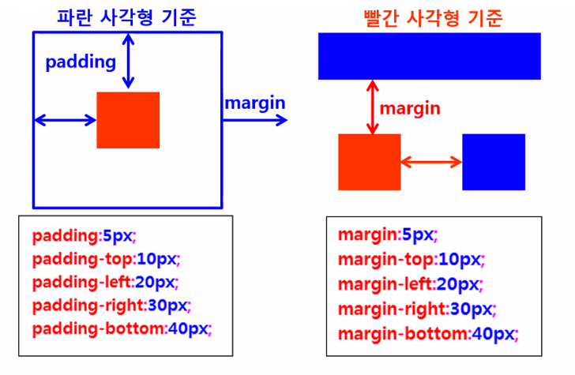

### 스타일 시트 (CSS)

* 스타일 시트 (CSS)
  * Cascading Style Sheets : 계단형 스타일 시트
    * 단계적으로 스타일 적용
    * 여러 스타일이 겹치면 맨 마지막 스타일 적용
  * HTML의 레이아웃 배치 등의 한계를 보완하기 위해 개발된 독립 언어
  * 일정 기능들을 미리 지정하여 여러 부분에서 동일하게 적용
* 가능한 작업
  * HTML 문서 내의 글꼴 종류, 크기, 색, 배경, 테두리, 레이아웃 배치, 여백 등 지정
  * 글자의 정렬 방식, 글자의 그림자 지정 등 다양한 효과


* 스타일 시트의 장점
  * 자유롭게 웹 문서 편집
    * HTML로 작성할 때 발생하는 글꼴, 색상, 배경, 테두리, 레이아웃 배치 등의 한계점 극복 가능
  * 통일감 있는 문서 작성
    * 한 번만 정의하여 문서에 일관되게 적용 가능
  * 편리한 문서 관리
    * 외부스타일 스타일 시트 파일을 사용할 경우
    * 여러 웹 문서에 동일한 스타일 시트 사용 가능
    * 한 번만 수정하여 모든 웹 문서의 스타일을 동시에 변경 가능


* 스타일 시트 적용 방법

  * 문서 내부에 정의 (Embedded Style)

    * `<head>` 태그에 삽입

    * 문서 전체에 특정 효과 주기 위해 사용

      ```html
      <head>
      	<style type="text/css">
      		태그명 { 속성(property):값(value);}
      		body { font-size:15pt;color:blue;}
          </style>
      </head>
      ```

      

  * 외부 문서에서 연결 (Linked Style)

    * 별도의 스타일 시트 문서를 만들어 놓고 필요한 HTML 문서에 연결하여 사용

    * 웹사이트의 모든 문서에 동일한 효과를 적용하여 웹사이트에 통일감을 주고 싶을 때 사용

      ```html
      <head>
      	<link rel="stylesheet" type="text/css" href="파일명">
      </head>
      ```

      

  * 태그에 직접 정의 (Inline Style)

    * 특정 태그에만 스타일 시트를 적용할 때 사용

      ```html
      <태그명 style="속성(property):값(value)";>
      <body style="font-size:15pt; color:blue;">
      <button onClick="green()" style="width:120; height:30">
      ```

      

* 스타일 시트의 기본 형식

  * 선택자 (selector)

    * 스타일을 적용할 대상

    * HTML 문서의 태그, 아이디, 클래스, 속성

      1. 태그 선택자

         * 태그명 사용

         * 요소(element) 선택자라고도 함

         * HTML 문서에 있는 같은 모든 태그에 동일하게 적용

           ```html
           <!-- 모든 <h3> 태그에 동일하게 CSS 적용 -->
           h3 {
           	background-color:#000;
           	color:#fff;
           	width:50%;
           	margin-left:20px;
           }
           ```

           

      2. 클래스 선택자

         * . (dot) 사용

         * 문서에서 특정 부분에만 필요한 CSS를 적용할 때 사용

         * 사용자 정의 선택자 또는 도트(.) 선택자라고도 함

         * 정의한 클래스 선택자를 태그에 사용

           ```html
           .className { 속성: 값;}
           <태그명 class="className"></태그명>
           ```

           

      3. 아이디 선택자

         * `#` 사용

         * 문서에서 특정 부분에만 필요한 CSS를 적용할 때 사용

         * 필요한 부분에 유일한 아이디를 지정하고 CSS 적용

         * 식별 선택자라고도 함

           ```html
           #idName { 속성:값; }
           <태그명 id="idname"></태그명>
           ```

           

      4. 속성 선택자

         * 문서에 삽입된 HTML 태그(요소)의 지정된 속성 값에 따라 선택자로 정의

         * ex) `<a>` 태그의 title 속성 값

           * `<a title="산업기사">산업기사</a>`

           ```html
           태그명[속성]
           태그명[속성="값"]
           ```

           

      5. 상태 선택자

         * 선택자:`checked` : 체크된 input 태그 선택
         * 선택자:`focus` : 포커스를 받은 input 태그 선택
         * 선택자:`enabled` : 사용 가능한 input 태그 선택
         * 선택자:`disabled` : 사용 불가능한 input 태그 선택

         

  * { 속성: 값;}

    * 변경하고자 하는 속성

    * 글꼴, 크기, 색상 등

      ```html
      <!-- 모든 <h1> 태그에 다음 스타일 적용 -->
      h1 { color:red; }
      ```


### CSS 속성

* 속성의 종류
  * 텍스트 속성
  * 배경 색상/이미지 관련 속성
  * 테두리 속성
  * 여백 속성
  * display 속성 : inline / block / inline-block
  * float 속성
  * 목록 관련 속성
  * 위치 관련 속성
  * 겹침 (레이어)


#### 텍스트 속성

```html
font-family:"굴림", "맑은 고딕"; /* 1순위, 2순위, ... */
font-size:40px;
color:blue; /* 글자색 */
font-style:italic;
font-weight:bold; /* 굵게 */
text-decoration:underline;
letter-spacing:3px; /* 글자 사이 간격 */
word-spacing:5px; /* 단어 사이 간격 */
line-height:10px /* 줄 간격 */
text-align:center;
text-shadow:2px 2px 2px black; /* 가로 세로 크기 색상 순 */
```


#### 배경 색상/ 이미지 관련 속성

* 배경색

  ```html
  background-color:#00ff00;
  background-color:#333;
  ```

* 배경 이미지/반복

  ```html
  background-image:url(back.png);
  background-repeat:repeat;
  background-repeat:no-repeat;
  background-repeat:repeat-x;
  background-repeat:repeat-y;
  ```

* 테두리 속성

  * 테두리의 유형/ 두께/ 색상 지정

  ```html
  border:solid 1px red; /* 실선 1픽셀 빨간색 */
  border-style:solid;
  border-width:3px /* thin medium thick */
  border-left:dotted;
  border-right:double;
  border-bottom:dashed;
  border-top:solid;
  border-color:red;
  border-radius:10px; /* 모서리 둥글게 */
  border-bottom-right-radius:50px;
  ```

* 여백 속성 (padding / margin)

  

* inline / block

  * display에서 inline과 block의 차이
    * `block`
      * 행으로 배치
      * 옆으로 나란히 배치 안 됨
      * 여백 있음
    * `inline`
      * 옆으로 나란히 배치
      * 여백 없이 내용물 만큼만 공간을 차지함
    * `inline-block`
      * 인라인, 블록, 성격 모두 포함


#### 목록 관련 속성

* type 유무

  ```html
  ul {list-style-type:square;}
  ul {list-style-type:none;}
  ```

* 불릿 기호 없애고 가로로 배치

  ```html
  ul li {display:inline;}
  ```

  


#### 위치 관련 속성

* position 속성
  * static
    * 다른 요소와 겹치지 않게 배치
    * 위치를 지정하지 않으면 static 적용 (디폴트값)
  * relative
    * static의 원래 위치를 기준으로 계산
  * absolute
    * 가장 가까운 상위 요소를 기준으로 배치
    * 상위 요소가 static인 경우에는 브라우저 화면 기준
  * fixed
    * 브라우저 화면을 기준으로 고정 위치에 배치


#### 겹침(레이어) 표현 속성

* z-index 속성

  * 요소들이 겹칠 때 순서 지정
  * 나중에 배치하는 것이 위에 놓임
  * z-index _값이 클수록 위에 놓임_

  


#### 자식/자손 선택자 (상속 선택자)

* 자식/자손의 개념


```html
<!DOCTYPE html>
<html>
<head>
<meta charset="UTF-8">
<title>first-child 선택자</title>
	<style type="text/css">
		#content div{ /* content의 모든 자손 <div> */
			width:400px;
			height:50px;
			border:solid 1px black;
		}
		/* div:first-child 작성 시 주의 : 콜론 앞으로 띄어쓰기 하면 안 됨 */
		#content div:first-child{ /* 첫 번째 자손 <div> */
			background:yellow;
		}

		#content div:first-child + div{ /* 두 번째 자손 <div> */
			background:green;
		}

		/*#content div:first-child + div+div{ !* 세 번째 자손 <div> */
		#content div:nth-child(3) { /* 세 번째 자손 <div> */
			background: indigo;
		}

		#content div:nth-child(4) { /* 네 번째 자손 <div> */
			background:pink;
		}

	</style>
</head>
<body>
	<div id="content">
		<div></div>
		<div></div>
		<div></div>
		<div></div>
	</div>
</body>
</html>
```

```html
<!DOCTYPE html>
<html>
<head>
<meta charset="UTF-8">
<title>테이블에서 짝수 행 선택 </title>
	<style type="text/css">		
    #stdTable {
        margin:0 auto;
        border-collapse:collapse; /* 테이블을 단일 경계선으로 변경 */
    }

    #stdTable th {
        color:white;
        background-color:darkblue;
    }
    /* 아래와 같이 클래스 선택해도 동일함
    .name {width:100px;}
    .email {width:200px;}
     */
    #stdTable th.name {width:100px;}
    #stdTable th.email {width:200px;}

    #stdTable td {height:20px;}

    /* 짝수행 선택 */
    #stdTable tr:nth-child(2n) td {
        background:yellow;
    }

    </style>
</head>

<body>
    <table id="stdTable" border="1">
        <tr> <th class="name">이름</th>
                 <th class="email">이메일</th></tr>
        <tr><td></td><td></td></tr>
        <tr><td></td><td></td></tr>
        <tr><td></td><td></td></tr>
        <tr><td></td><td></td></tr>
        <tr><td></td><td></td></tr>
        <tr><td></td><td></td></tr>
        <tr><td></td><td></td></tr>
        <tr><td></td><td></td></tr>
        <tr><td></td><td></td></tr>
        <tr><td></td><td></td></tr>        
    </table>
</body>
</html>

```


#### 동적(반응) 선택자

* 동적 선택자 (반응 선택자)
  * 선택자: active - 마우스로 클릭한 태그 선택
  * 선택자: hover - 마우스를 올린 태그
* ex) 링크 태그
  * a: active - 마우스로 클릭했을 때
  * a: hover - 마우스를 올렸을 때
  * a: link - 방문하지 않은 링크 스타일
  * a: visited - 방문된 링크 스타일


#### Overflow

* overflow 속성
  * 자식 요소가 부모 요소의 범위를 벗어났을 때 어떻게 처리할 것인지 지정
  * hidden
    * 부모 영역을 벗어나는 부분은 보이지 않게 처리
  * scroll
    * 스크롤바 표시 (가로/세로)
  * auto
    * 자동으로 필요한 부분에만 스크롤바 표시

```html
<!DOCTYPE html>
<html>
<head>
<meta charset="UTF-8">
<title>테이블에서 짝수 행 선택 </title>
	<style type="text/css">		
    #stdTable {
        margin:0 auto;
        border-collapse:collapse; /* 테이블을 단일 경계선으로 변경 */
    }

    #stdTable th {
        color:white;
        background-color:darkblue;
    }
    /* 아래와 같이 클래스 선택해도 동일함
    .name {width:100px;}
    .email {width:200px;}
     */
    #stdTable th.name {width:100px;}
    #stdTable th.email {width:200px;}

    #stdTable td {height:20px;}

    /* 짝수행 선택 */
    #stdTable tr:nth-child(2n) td {
        background:yellow;
    }

    </style>
</head>

<body>
    <table id="stdTable" border="1">
        <tr> <th class="name">이름</th>
                 <th class="email">이메일</th></tr>
        <tr><td></td><td></td></tr>
        <tr><td></td><td></td></tr>
        <tr><td></td><td></td></tr>
        <tr><td></td><td></td></tr>
        <tr><td></td><td></td></tr>
        <tr><td></td><td></td></tr>
        <tr><td></td><td></td></tr>
        <tr><td></td><td></td></tr>
        <tr><td></td><td></td></tr>
        <tr><td></td><td></td></tr>        
    </table>
</body>
</html>
```


#### 투명도/ 가시성

* 투명도(불투명도)
  * opacity 속성
    * 0 ~ 1 사이의 값 지정
    * 0 : 투명
    * 1 : 불투명
    * 0.5 : 반투명
* 가시성
  * visibility 속성
    * hidden : 숨김
    * visible : 보임