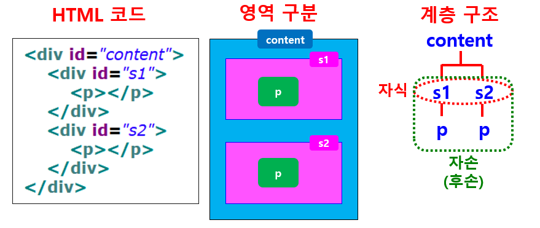

# 웹개발

#### 웹의 동작 구조


* HTTP(Hyper Text Transfer Protocol)
  * 인터넷  통신 규약


## HTML

#### Hyper Text Markup Language

* 웹 브라우저에서 하이퍼텍스트 기능을 구현하는 웹 페이지 작성 언어
  * 하이퍼텍스트 : 문서간 서로 링크가 설정되어 링크 설정 부분을 클릭하면 해당 문서로 이동하는 기능


#### HTML 문서의 구성

* __태그__라는 명령어
* 출력하고자 하는 문서 __내용__


#### 태그

* 태그(tag)
  * HTML에서 사용하는 명령어 (문자열 기호)
  * 원하는 모양과 형태로 브라우저에게 명령을 내림


##### 태그 사용 형식

* 대부분 시작 태그(<태그명>)과 종료 태그(</태그명>)를 함께 사용함

  ```html
  <태그명>출력 내용</태그명>
  <title>문서 제목</title>
  
  <태그명 속성명="속성값">출력내용</태그명>
  <a href="a.html" target="_blank">이동</a>
  ```

  

* 예외로 종료 태그 없이 혼자 사용

  * ```<Br> ``` : 줄 바꿈
  * `` : 이미지 삽입
  * `<hr>` : 수평선 삽입

* _태그는 대소문자 구별 없이 사용 가능함_

  


#### URL

* Uniform Resource Locator
  * 인터넷 주소
    * 예시 : https://www.naver.com


####  HTML 문서 구조


* Head 부분
  * 문서의 정보를 작성하는 부분
  * 문서의 제목 설정
    * `<title>Insert title here</title>`
  * 문자 세트 설정
    * `<meta charset="UTF-8">`
    * 문자열 처리 방식
  * 외부 파일 연결
  * CSS 정의
  * 자바스크립트 정의
  * 기타


### 기본 태그

* 기본 태그의 종류
  1. HTML 문서 구조 태그
  2. 텍스트 관련 태그
  3. 하이퍼링크 태그
  4. 목록 태크
  5. 테이블 태그
  6. 이미지/이미지맵 태그
  7. 입력 양식 태그
  8. 공간 분할 태그(HTML5 시멘틱 구조 태그)


#### 문서 구조 태그

* `<html></html>`
* `<head></head>`
* `<body></body>`

```html
<!DOCTYPE html>
<html lang="en">
<head>
    <meta charset="UTF-8">
    <title>줄바꿈 공백문자 사용</title>
</head>
<body>
HTML 문서를<br>
작성중입니다. &nbsp; &nbsp; &nbsp; &nbsp; &nbsp; 탭키를 5번 눌러주세요.<br>
새줄에서 시작했습니다
</body>
</html>
```


* `<head>` 태그

  * 웹 브라우저 화면에는 보이지 않지만 웹 브라우저가 알아두어야 할 문서정보를 포함

* `<meta>` 태그

  * 문자 인코딩 및 문서 키워드, 문서 정보

    `<meta charset="UTF-8">`

* `<link>` 태그

  * 외부 리소스 연결

    `<link rel="stylesheet" href="StyleSheet.css">`

* `<title></title>` 태그

  * 문서 제목

* `<body>` 태그

  `<body></body>`

  * 문서의 몸통 부분
  * 실제 화면에 보이는 문서 내용을 포함
  * 대부분의 태그가 `<body>`와 `</body>` 사이에 위치함


#### 텍스트 관련 태그

* 제목

  `<hn></hn>`

  `예: <h1></h1>`

  * Headline의 약어
  * 제목을 위해 사용
  * 줄바꿈하여 출력
  * 크기는 1~6 : 1이 제일 크고, 6이 제일 작음

  

* 본문

  `<p></p>`

  * 문단을 나누는 태그(paragraph의 약어)
  * `<br>` 태그를 2번 사용한 만큼의 간격
  * 여러 번 연속적으로 사용해도 행 간격이 더 벌어지지 않음

  `<br>`

  * 줄바꿈

  `<hr>`

  `<span></span>`

  * 줄바꿈 없이 영역 묶기

  * 태그 자체로는 아무 의미가 없지만 텍스트 단락 안에서 줄바꿈 없이 일부 텍스트만 묶어서 스타일을 적용하려고 할 때 주로 사용함

    ```html
     멀티캠퍼스<span>KDigital</span>
    ```

    

* 텍스트 형태(장식효과)

  `<b>`

  `<i>`

  `<strong>`

  `<em>`

  `<sub> <sup>`

  `<ins>`

  `<del>`

* 엥커 태그

  `<a></a>`

```html
<!DOCTYPE html>
<html lang="en">
<head>
    <meta charset="UTF-8">
    <title>텍스트 관련 태그</title>
</head>
<body>
  <h3>h3: : 텍스트에 장식 효과를 주는 태그들</h3>
  <b> b : 굵은 표시(텍스트 강조) </b>
  <strong>strong : 굵은 표시(텍스트 강조)</strong><br>
  <i>i : 이탤릭체 </i>
  <em>em : 이탤릭체(텍스트 강조)</em><br>
  <small>small : 현재 설정된 크기보다 2pt 작게</small>
  <big>big : 현재 설정된 크기보다 2pt 크게</big><br>
  텍스트 <sub>sub : 아래첨자</sub><br>
  텍스트 <sup>sup : 위첨자</sup><br>
  <ins>ins : 밑줄 표시</ins>
  <del>del : 가운데줄 표시(취소선)</del><br>

  <pre>
                   입력한 형식 그대로 출력
  작성한대로 보여주기
  시작은 여기부터
  </pre>

</body>
</html>
```


#### 하이퍼링크 태그

* 하이퍼링크로 문서를 연결하는 `<a>` 태그 (앵커 태그)
  * 원하는 문서나 사이트로 연결
  * 새 창 또는 새 탭에서 링크 열기
  * 한 페이지 안에서 저장된 영역으로 이동


* `target`
  * 하이퍼링크의 대상인 문서를 어디에서 보여줄지를 지정
    * _blank : 새 창에서 출력
    * _parent : 현재 프레임을 호출한 상위 프레임에 출력
    * _self : 현재 화면에 출력
    * _top : 프레임을 모두 없애고 화면 전체에 출력


```html
<!DOCTYPE html>
<html lang="en">
<head>
    <meta charset="UTF-8">
    <title>hyperlink</title>
</head>
<body>
	<h3>사이트로 이동</h3>
    <a href="http://www.naver.com">네이버 사이트로 이동</a>
    <a href="#">이동 타겟이 미정</a>
    <a href="http://www.daum.net" target="_blank"> 다음으로 이동(새창에서 나타남)</a>

    <hr>
    <h3>다른 문서로 이동</h3>
    <a href="01_h.html">h.html_현재 창에서 이동_</a>
    <a href="02_text.html" target="_self">text.html_현재 창에서 이동_</a>

    <hr>
    <h3>태그 중첩</h3>
    <b><a href="http://www.kbs.co.kr"><i>kbs로 이동</i></a></b>

    <hr>
    <h3>문서 내 다른 영역으로 이동</h3>
    <!-- href 속성값으로 넘겨주는 id는 대소문자를 구별함 -->
    <a href="#javascript">id가 javascript인 영역으로 이동</a><br>
    <a href="#jQuery">id가 jQuery인 영역으로 이동</a><br>
    <a href="#css">id가 CSS인 영역으로 이동</a><br>
    <hr>

    <h3 id="javascript">자바스크립트</h3>
    <p>웹 페이지를 향상시키고 동적인 화면을 구현하기 위해 사용되는 스크립트 언어 </p>
    <h3 id="jQuery">jQuery</h3>
    <p>자바스크립트 작업을 쉽고 빠르게 처리할 수 있도록 도와주는 자바스크립트 라이브러리 </p>
    <h3 id="css">CSS</h3>
    <p>Cascading Style Sheet : 속성을 이용해 웹 디자인 요소를 제어하는 기능</p>
</body>
</html>
```


#### 목록 태그

* 기본 목록: `<ul> <ol> <li>`

  


* 순서가 없는 `<ul>` 태그 속성


* 순서가 있는 `<ol>` 태그 속성


```html
<!DOCTYPE html>
<html lang="en">
<head>
    <meta charset="UTF-8">
    <title>목록태그</title>
</head>
<body>
<!-- ul/ol/il 태그는 블럭태그(한 행을 모두 사용함 -->
    <ul type="disc">
      <li>Javascript/jQuery</li>
      <li>웹 프로그래밍</li>
      <li>인터넷 프로그래밍</li>
      <li>데이터베이스</li>
    </ul>

    <ul type="circle">
      <li>포도</li>
      <li>복숭아</li>
      <li>수박</li>
      <li>딸기</li>
    </ul>

    <ul type="square">
      <li>강아지</li>
      <li>고양이</li>
      <li>이구아나</li>
      <li>고슴도치</li>
    </ul>

<hr>

    <ol type="1">
      <li>강아지</li>
      <li>고양이</li>
      <li>이구아나</li>
      <li>고슴도치</li>
    </ol>

    <ol reversed>
      <li>강아지</li>
      <li>고양이</li>
      <li>이구아나</li>
      <li>고슴도치</li>
    </ol>

    <ol type="A">
      <li>강아지</li>
      <li>고양이</li>
      <li>이구아나</li>
      <li>고슴도치</li>
    </ol>

    <ol type="i" start="2">
      <li>강아지</li>
      <li>고양이</li>
      <li>이구아나</li>
      <li>고슴도치</li>
    </ol>

</body>

```


```html
<!DOCTYPE html>
<html lang="en">
<head>
    <meta charset="UTF-8">
    <title>중첩 목록 태그</title>
</head>
<body>
<h4>멀티미디어 콘텐츠 제작</h4>

<ol type="1">
  <li>웹 프로그래밍</li>
    <ul type="square">
      <li>JSP</li>
      <li>ASP</li>
      <li>PHP</li>
      <li>DJango</li>
    </ul>
  <li>웹 디자인</li>
    <ol type="i">
      <li>HTML</li>
      <li>CSS</li>
      <li>JavaScript</li>
      <li>jQuery</li>
    </ol>
  <li>모바일 앱</li>
      <ol type="A">
      <li>네이티브 앱</li>
      <li>모바일 웹</li>
      <li>모바일 웹 앱</li>
        <ul type="circle">
          <li>jQuery 프레임워크</li>
        </ul>
    </ol>
</ol>

</body>
</html>
```


* 정의 목록 : `<dl> <dt> <dd>`


#### 테이블 태그

* 테이블 관련 태그

  * `<table>` : 테이블 선언 태그

  * `<tr>` : 테이블 내에 한 행을 정의하는 태그

  * `<td>` : 테이블 내의 한 열, 즉 셀을 만들 때 사용되는 태그

    

* `<table>` 태그 속성

  

* `<tr>` 태그의 속성

  

* `<td>` 태그의 속성


```html
<!DOCTYPE html>
<html lang="en">
<head>
    <meta charset="UTF-8">
    <title>Table 태그</title>
    <!-- css 활용해서 td 태그의 넓이는 100px로 일괄 설정함 -->
<!--    <style>-->
<!--      td {width:100px:}-->
<!--    </style>-->
</head>
<body>
  <table border="1">
    <caption>테이블1</caption><!-- 표 제목 설정-->
    <thead align="center">
    <tr><th>a1</th><th>b1</th><th>c1</th><th>d1</th></tr>
    <tr><td>a2</td><td>b2</td><td>c2</td><td>d2</td></tr>
    <tr><td>a3</td><td>b3</td><td>c3</td><td>d3</td></tr>
    <tr><td>a4</td><td>b4</td><td>c4</td><td>d4</td></tr>
    <tr><td>a5</td><td>b5</td><td>c5</td><td>d5</td></tr>
    </thead>
  </table>
<hr>

  <table border="1">
    <caption>테이블2</caption><!-- 표 제목 설정-->
    <thead align="center">
    <tr><th>a</th><th>b</th><th>c</th><th>d</th></tr>
    <tr><td rowspan="4">a1</td><td colspan="3">b1</td></tr>
    <tr><td>b2</td><td>c2</td><td>d2</td></tr>
    <tr><td rowspan="2">b3</td><td>c3</td><td rowspan="3">d3</td></tr>
    <tr><td>c4</td></tr>
    </thead>
  </table>


</body>

```


#### 이미지 태그

* `` 태그

  * 인라인 태그로 이미지 바로 옆에 다른 요소가 나란히 배치

  * 여러 개의 `` 태그를 사용하면 계속해서 __오른쪽__에 표시

  * `` 태그 속성

    

  * 이미지 파일 경로

    * HTML파일과 같은 폴더에 있는 경우

      * 이미지 파일명만

        ``

    * 하위 폴더에 있는 경우

      * 폴더명/이미지파일명

        ``

    * 상위 폴더에 있는 경우

      * ./폴더명/이미지파일명

        ``

    ```html
    <!DOCTYPE html>
    <html lang="en">
    <head>
        <meta charset="UTF-8">
        <title>이미지 태그</title>
    </head>
    <body>
    
      <!-- 이미지에 링크 연결 - a 태그와 중첩으로 사용 -->
      <a href="04_list.html"></a>
      
    </body>
    </html>
    ```

    

  * `` 태그의 usemap 속성

    * 이미지 맵 지정

    * 사용방법

      * `<map>` 태그를 이용해 이미지 맵을 만들고
      * `` 태그의 usemap 속성으로 이미지 맵 지정
        * 이미지 맵
          * 하나의 이미지에 여러 개의 링크를 만들어 놓고 각 영역마다 다른 링크 연결

      ```html
      <!DOCTYPE html>
      <html lang="en">
      <head>
          <meta charset="UTF-8">
          <title>이미지 맵</title>
      </head>
      <body>
          <center>
              
              <map name="citymap">
                  <area shape="rect" coords="60,90,250,150" href="뉴욕.html">
                  <area shape="rect" coords="310, 90, 500, 150"  href="파리.html">
                  <area shape="rect" coords="560, 90, 750, 150"  href="로마.html">
                  <area shape="rect" coords="810, 90, 1000, 150"  href="베이징.html">
              </map>
          </center>
      </body>
      </html>
      ```

      

* `<figure>` 태그 

  * 한 줄에 하나의 figure 요소 표시

    

* `<iFrame>` 태그

  * 현재 html 문서 내에 다른 문서 포함

    


#### 입력 양식 태그

* 입력 양식 태그

  * 입력 양식을 만들 때 사용하는 태그

    * `<form>`

      * 입력 양식을 구성하는 기본 골격 제공

        ```html
        <form method="post" action="loginOk.jsp">
        	다양한 입력 양식 태그 포함
        </form>
        ```

        

      

    * `<label>`

      * 폼 요소에 캡션 붙이기

    * `<input>`

      * 데이터를 입력받기 위한 태그

        ```
        <label> 아이디 : <input type="text" id="id" name="id"> </label>
        ```

        

        

    * `<select> <optgroup> <option>`

    * `<textarea>`

    ```html
    <!DOCTYPE html>
    <html lang="en">
    <head>
        <meta charset="UTF-8">
        <title>입력 양식 태그</title>
    </head>
    <body>
            <!-- method = get/ post
             서버로 data를 전송하기 위해서 각 태그는 name 속성을 설정하는 것이 일반적임 -->
            <form method="post" action="http://test.co.kr/web/newMember.jsp">
            label 태그 사용하지 않음<p>
            성명 <input type="text" id="name" size="10" autofocus><br>
            <input type="text" id="prdNo" hidden>
            <hr>
    
            label 태그 사용하지 않고 힌트 출력<p>
                <input type="text" name="id" size="10" placeholder="아이디"><br>
            <br>
    
            <hr>
            label 태그 사용<p>
            <label name="name">성명</label>
            <input type="text" id="name2" size="10">
            <br><br>
            <label>아이디<input type="text" id="id" size="10" maxlength="8"></label><br><br>
            <label>우편번호 <input type="text" id="zipcode" value="10010" readonly></label><br><br>
            <label>주소<input type="text" id="address" required> </label><br><br>
            <!-- required : 필수입력필드 - 주소는 입력해야 submit(서버로 데이터 전달)이 발생할 수 있음 -->
            <hr>
            <label>비밀번호 <input type="password" id="pass" size="10" maxlength="8"> </label><br><br>
            <!-- 라디오버튼과 체크박스에 <label> 내부에 input태그의 유무 차이점은 텍스트를 클릭할 때 선택 여부에 따라 다름 -->
    
            학년 :
            <label><input type="radio" name="year" value="1"> 1학년 </label>
            <label><input type="radio" name="year" value="2"> 2학년 </label>
                <!-- 이런 형태의 태그 중첩을 많이 사용함 -> 그래야 클릭의 범위가 넓어지기 때문 -->
            <label><input type="radio" name="year" value="3"> 3학년 </label>
            <label><input type="radio" name="year" value="4"> 4학년 </label>
                <!-- name = year1이기 때문에 위쪽 라디오버튼과는 다른 그룹을 만든 것임 -> 라디오(radio) 단일선택은 name에 종속됨 -->
            <label><input type="radio" name="year1" value="none"> other </label><br><br>
    
            취미 :
            <label><input type="checkbox" id="game" value="게임" checked> 게임</label>
            <label><input type="checkbox" id="movie" value="영화"> 영화</label>
            <label><input type="checkbox" id="reading" value="독서"> 독서 </label>
            <label><input type="checkbox" id="sports" value="운동"> 운동 </label><br><br>
    
    
            <!-- input type = file 이면 파일선택 대화상자가 자동 출력됨 -->
            첨부파일 선택 : <input type="file" size="30"><br><br>
            <!-- input type=button -> form 태그의 데이터를 전송하기 위한 준비단계로 봄
                 입력된 데이터의 유효성 검사를 하기 위해 서버와 통신할 때 알림 태그로 많이 사용함 -->
            <input type="button" value="아이디 중복 확인">
    
            <!-- 이미지 버튼 생성 - 보통 submit 결과가 나타나게 됨 -->
            <input type="image" id="orderImg" src="image/cart.jpg">
            <br><br>
    
            <br><br>
            <label> 이메일 <input type="email"> <br><br></label>
    
            <!-- dropdown list 구성 <select> 와 <option> 태그를 이용해서 생성
            selected 속성값은 기본 선택 항목을 설정함 -->
            여행하고 싶은 나라 :
            <select name="nation">
               <option value="미국">미국</option>
               <option value="중국">중국</option>
               <option value="호주" selected>호주</option>
               <option value="일본">일본</option>
               <option value="브라질">브라질</option>
               <option value="기타">기타</option>
            </select>
            <br><br>
    
            자기 소개 <br>
            <!-- 여러 줄 입력이 가능한 텍스트창은 <textarea rows=행수 cols=한 행의 글자 수> 태그를 이용해서 생성 -->
            <textarea rows="10" cols="50" name="content"></textarea>
            <!-- input type=submit : 전송버튼 / input type=reset : 취소버튼(입력한 것을 모두 지움) -->
            <input type="submit" value="회원가입"><input type="reset" value="취소">
    </form>
    </body>
    </html>
    
    <!--
    확인
    autofocus : 입력 커서 표시
    hidden : 안 보임
    placeholder : 입력 힌트 표시
    maxlength : 최대 길이 (한글/영문/숫자)
    value : 초기값(서버로 전송되는 값을 의미 - input type="text"인 경우 사용자가 입력한 내용이 value 속성 값으로 지정)
    readonly : 읽기만 가능 (입력 안됨)
    required : 필수로 지정
    -->
    
    
    ```

    

    * `<fieldset>`

    * `<legend>`

      


#### 공간 분할 태그

* `<div>` 태그
  * block 형식으로 공간 분할
* `<span>` 태그
  * inline 형식으로 공간 분할

```html
<!DOCTYPE html>
<html lang="en">
<head>
    <meta charset="UTF-8">
    <title>div 태그 다르게 선택</title>
    <style type="text/css">
      div {width:100px; height:30px; border:solid 1px black;}
      .redbox {background:red}
      .bluebox {background:blue}
    </style>
</head>
<body>

<!-- div 는 block 태그이기 때문에 한 행을 모두 차지 -->
<!--
     클래스 선택자를 사용할 때는 해당 태그에 class=클래스명 속성을 지정해야 함
     동일 css를 적용시키고자 하는 태그에는 같은 클래스명을 지정해야 함
     클래스명은 중복될 수 있다
     -->
<div class="redbox">div1</div>
<div class="redbox">div2</div>
<div class="bluebox">div3</div>
<div class="bluebox">div4</div>

</body>
</html>
```


### 스타일 시트 (CSS)

* 스타일 시트 (CSS)
  * Cascading Style Sheets : 계단형 스타일 시트
    * 단계적으로 스타일 적용
    * 여러 스타일이 겹치면 맨 마지막 스타일 적용
  * HTML의 레이아웃 배치 등의 한계를 보완하기 위해 개발된 독립 언어
  * 일정 기능들을 미리 지정하여 여러 부분에서 동일하게 적용
* 가능한 작업
  * HTML 문서 내의 글꼴 종류, 크기, 색, 배경, 테두리, 레이아웃 배치, 여백 등 지정
  * 글자의 정렬 방식, 글자의 그림자 지정 등 다양한 효과


* 스타일 시트의 장점
  * 자유롭게 웹 문서 편집
    * HTML로 작성할 때 발생하는 글꼴, 색상, 배경, 테두리, 레이아웃 배치 등의 한계점 극복 가능
  * 통일감 있는 문서 작성
    * 한 번만 정의하여 문서에 일관되게 적용 가능
  * 편리한 문서 관리
    * 외부스타일 스타일 시트 파일을 사용할 경우
    * 여러 웹 문서에 동일한 스타일 시트 사용 가능
    * 한 번만 수정하여 모든 웹 문서의 스타일을 동시에 변경 가능


* 스타일 시트 적용 방법

  * 문서 내부에 정의 (Embedded Style)

    * `<head>` 태그에 삽입

    * 문서 전체에 특정 효과 주기 위해 사용

      ```html
      <head>
      	<style type="text/css">
      		태그명 { 속성(property):값(value);}
      		body { font-size:15pt;color:blue;}
          </style>
      </head>
      ```

      

  * 외부 문서에서 연결 (Linked Style)

    * 별도의 스타일 시트 문서를 만들어 놓고 필요한 HTML 문서에 연결하여 사용

    * 웹사이트의 모든 문서에 동일한 효과를 적용하여 웹사이트에 통일감을 주고 싶을 때 사용

      ```html
      <head>
      	<link rel="stylesheet" type="text/css" href="파일명">
      </head>
      ```

      

  * 태그에 직접 정의 (Inline Style)

    * 특정 태그에만 스타일 시트를 적용할 때 사용

      ```html
      <태그명 style="속성(property):값(value)";>
      <body style="font-size:15pt; color:blue;">
      <button onClick="green()" style="width:120; height:30">
      ```

      

* 스타일 시트의 기본 형식

  * 선택자 (selector)

    * 스타일을 적용할 대상

    * HTML 문서의 태그, 아이디, 클래스, 속성

      1. 태그 선택자

         * 태그명 사용

         * 요소(element) 선택자라고도 함

         * HTML 문서에 있는 같은 모든 태그에 동일하게 적용

           ```html
           <!-- 모든 <h3> 태그에 동일하게 CSS 적용 -->
           h3 {
           	background-color:#000;
           	color:#fff;
           	width:50%;
           	margin-left:20px;
           }
           ```

           

      2. 클래스 선택자

         * . (dot) 사용

         * 문서에서 특정 부분에만 필요한 CSS를 적용할 때 사용

         * 사용자 정의 선택자 또는 도트(.) 선택자라고도 함

         * 정의한 클래스 선택자를 태그에 사용

           ```html
           .className { 속성: 값;}
           <태그명 class="className"></태그명>
           ```

           

      3. 아이디 선택자

         * `#` 사용

         * 문서에서 특정 부분에만 필요한 CSS를 적용할 때 사용

         * 필요한 부분에 유일한 아이디를 지정하고 CSS 적용

         * 식별 선택자라고도 함

           ```html
           #idName { 속성:값; }
           <태그명 id="idname"></태그명>
           ```

           

      4. 속성 선택자

         * 문서에 삽입된 HTML 태그(요소)의 지정된 속성 값에 따라 선택자로 정의

         * ex) `<a>` 태그의 title 속성 값

           * `<a title="산업기사">산업기사</a>`

           ```html
           태그명[속성]
           태그명[속성="값"]
           ```

           

      5. 상태 선택자

         * 선택자:`checked` : 체크된 input 태그 선택
         * 선택자:`focus` : 포커스를 받은 input 태그 선택
         * 선택자:`enabled` : 사용 가능한 input 태그 선택
         * 선택자:`disabled` : 사용 불가능한 input 태그 선택

         

  * { 속성: 값;}

    * 변경하고자 하는 속성

    * 글꼴, 크기, 색상 등

      ```html
      <!-- 모든 <h1> 태그에 다음 스타일 적용 -->
      h1 { color:red; }
      ```


### CSS 속성

* 속성의 종류
  * 텍스트 속성
  * 배경 색상/이미지 관련 속성
  * 테두리 속성
  * 여백 속성
  * display 속성 : inline / block / inline-block
  * float 속성
  * 목록 관련 속성
  * 위치 관련 속성
  * 겹침 (레이어)


#### 텍스트 속성

```html
font-family:"굴림", "맑은 고딕"; /* 1순위, 2순위, ... */
font-size:40px;
color:blue; /* 글자색 */
font-style:italic;
font-weight:bold; /* 굵게 */
text-decoration:underline;
letter-spacing:3px; /* 글자 사이 간격 */
word-spacing:5px; /* 단어 사이 간격 */
line-height:10px /* 줄 간격 */
text-align:center;
text-shadow:2px 2px 2px black; /* 가로 세로 크기 색상 순 */
```


#### 배경 색상/ 이미지 관련 속성

* 배경색

  ```html
  background-color:#00ff00;
  background-color:#333;
  ```

* 배경 이미지/반복

  ```html
  background-image:url(back.png);
  background-repeat:repeat;
  background-repeat:no-repeat;
  background-repeat:repeat-x;
  background-repeat:repeat-y;
  ```

* 테두리 속성

  * 테두리의 유형/ 두께/ 색상 지정

  ```html
  border:solid 1px red; /* 실선 1픽셀 빨간색 */
  border-style:solid;
  border-width:3px /* thin medium thick */
  border-left:dotted;
  border-right:double;
  border-bottom:dashed;
  border-top:solid;
  border-color:red;
  border-radius:10px; /* 모서리 둥글게 */
  border-bottom-right-radius:50px;
  ```

* 여백 속성 (padding / margin)

  

* inline / block
  * display에서 inline과 block의 차이
    * `block`
      * 행으로 배치
      * 옆으로 나란히 배치 안 됨
      * 여백 있음
    * `inline`
      * 옆으로 나란히 배치
      * 여백 없이 내용물 만큼만 공간을 차지함
    * `inline-block`
      * 인라인, 블록, 성격 모두 포함


#### 목록 관련 속성

* type 유무

  ```html
  ul {list-style-type:square;}
  ul {list-style-type:none;}
  ```

* 불릿 기호 없애고 가로로 배치

  ```html
  ul li {display:inline;}
  ```

  


#### 위치 관련 속성

* position 속성
  * static
    * 다른 요소와 겹치지 않게 배치
    * 위치를 지정하지 않으면 static 적용 (디폴트값)
  * relative
    * static의 원래 위치를 기준으로 계산
  * absolute
    * 가장 가까운 상위 요소를 기준으로 배치
    * 상위 요소가 static인 경우에는 브라우저 화면 기준
  * fixed
    * 브라우저 화면을 기준으로 고정 위치에 배치


#### 겹침(레이어) 표현 속성

* z-index 속성

  * 요소들이 겹칠 때 순서 지정
  * 나중에 배치하는 것이 위에 놓임
  * z-index _값이 클수록 위에 놓임_

  


#### 자식/자손 선택자 (상속 선택자)

* 자식/자손의 개념




```html
<!DOCTYPE html>
<html>
<head>
<meta charset="UTF-8">
<title>first-child 선택자</title>
	<style type="text/css">
		#content div{ /* content의 모든 자손 <div> */
			width:400px;
			height:50px;
			border:solid 1px black;
		}
		/* div:first-child 작성 시 주의 : 콜론 앞으로 띄어쓰기 하면 안 됨 */
		#content div:first-child{ /* 첫 번째 자손 <div> */
			background:yellow;
		}

		#content div:first-child + div{ /* 두 번째 자손 <div> */
			background:green;
		}

		/*#content div:first-child + div+div{ !* 세 번째 자손 <div> */
		#content div:nth-child(3) { /* 세 번째 자손 <div> */
			background: indigo;
		}

		#content div:nth-child(4) { /* 네 번째 자손 <div> */
			background:pink;
		}

	</style>
</head>
<body>
	<div id="content">
		<div></div>
		<div></div>
		<div></div>
		<div></div>
	</div>
</body>
</html>
```

```html
<!DOCTYPE html>
<html>
<head>
<meta charset="UTF-8">
<title>테이블에서 짝수 행 선택 </title>
	<style type="text/css">		
    #stdTable {
        margin:0 auto;
        border-collapse:collapse; /* 테이블을 단일 경계선으로 변경 */
    }

    #stdTable th {
        color:white;
        background-color:darkblue;
    }
    /* 아래와 같이 클래스 선택해도 동일함
    .name {width:100px;}
    .email {width:200px;}
     */
    #stdTable th.name {width:100px;}
    #stdTable th.email {width:200px;}

    #stdTable td {height:20px;}

    /* 짝수행 선택 */
    #stdTable tr:nth-child(2n) td {
        background:yellow;
    }

    </style>
</head>

<body>
    <table id="stdTable" border="1">
        <tr> <th class="name">이름</th>
                 <th class="email">이메일</th></tr>
        <tr><td></td><td></td></tr>
        <tr><td></td><td></td></tr>
        <tr><td></td><td></td></tr>
        <tr><td></td><td></td></tr>
        <tr><td></td><td></td></tr>
        <tr><td></td><td></td></tr>
        <tr><td></td><td></td></tr>
        <tr><td></td><td></td></tr>
        <tr><td></td><td></td></tr>
        <tr><td></td><td></td></tr>        
    </table>
</body>
</html>

```


#### 동적(반응) 선택자

* 동적 선택자 (반응 선택자)
  * 선택자: active - 마우스로 클릭한 태그 선택
  * 선택자: hover - 마우스를 올린 태그
* ex) 링크 태그
  * a: active - 마우스로 클릭했을 때
  * a: hover - 마우스를 올렸을 때
  * a: link - 방문하지 않은 링크 스타일
  * a: visited - 방문된 링크 스타일


#### Overflow

* overflow 속성
  * 자식 요소가 부모 요소의 범위를 벗어났을 때 어떻게 처리할 것인지 지정
  * hidden
    * 부모 영역을 벗어나는 부분은 보이지 않게 처리
  * scroll
    * 스크롤바 표시 (가로/세로)
  * auto
    * 자동으로 필요한 부분에만 스크롤바 표시

```html
<!DOCTYPE html>
<html>
<head>
<meta charset="UTF-8">
<title>테이블에서 짝수 행 선택 </title>
	<style type="text/css">		
    #stdTable {
        margin:0 auto;
        border-collapse:collapse; /* 테이블을 단일 경계선으로 변경 */
    }

    #stdTable th {
        color:white;
        background-color:darkblue;
    }
    /* 아래와 같이 클래스 선택해도 동일함
    .name {width:100px;}
    .email {width:200px;}
     */
    #stdTable th.name {width:100px;}
    #stdTable th.email {width:200px;}

    #stdTable td {height:20px;}

    /* 짝수행 선택 */
    #stdTable tr:nth-child(2n) td {
        background:yellow;
    }

    </style>
</head>

<body>
    <table id="stdTable" border="1">
        <tr> <th class="name">이름</th>
                 <th class="email">이메일</th></tr>
        <tr><td></td><td></td></tr>
        <tr><td></td><td></td></tr>
        <tr><td></td><td></td></tr>
        <tr><td></td><td></td></tr>
        <tr><td></td><td></td></tr>
        <tr><td></td><td></td></tr>
        <tr><td></td><td></td></tr>
        <tr><td></td><td></td></tr>
        <tr><td></td><td></td></tr>
        <tr><td></td><td></td></tr>        
    </table>
</body>
</html>
```


#### 투명도/ 가시성

* 투명도(불투명도)
  * opacity 속성
    * 0 ~ 1 사이의 값 지정
    * 0 : 투명
    * 1 : 불투명
    * 0.5 : 반투명
* 가시성
  * visibility 속성
    * hidden : 숨김
    * visible : 보임
