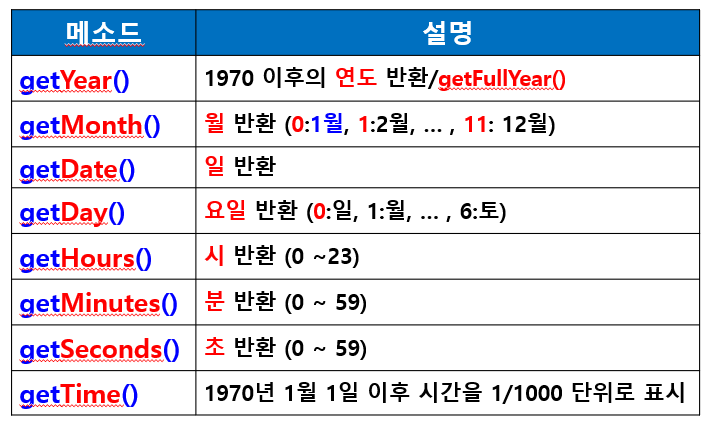

# JavaScript


#### 목차

* 자바스크립트 기본 구조
* 데이터 출력
* 변수 / 데이터 타입 / 연산자
* 제어문 (조건문 / 반복문)
* 배열
* 함수
* 자바스크립트 객체
  * 내장 객체
  * 브라우저 객체 모델
  * 문서 객체 모델 (DOM : Document Object Model)
  * 사용자 정의 객체
* 이벤트 핸들러와 이벤트 처리


#### 자바스크립트 (JavaScript)

* __동적인 웹 페이지를 작성하기 위하여 사용되는 언어__
* 웹의 표준 프로그래밍 언어
* 모든 웹 브라우저에서 자바스크립트 지원
* 웹 브라우저뿐 아니라 스마트폰용 애플리케이션 개발 등 각종 분야에서 능력과 가치를 인정받고 있음
  * 초기에는 브라우저에 내장되어 제한된 기능만 지원하였으나, 현재 Ajax(Asynchronous JavaScript and XML)라는 기술과 함께 영향력이 증가


#### 기능

* HTML이 지원하지 못하는 다양한 기능 지원
  * 동적인 움직임, 이벤트 발생 처리, 경고 메시지 출력 등
* Ajax를 이용하여 새로운 내용을 동적으로 로딩하거나 서버에 전송하여 동적인 페이지 생성
* 애니메이션 기능 추가
  * 페이드인, 페이드아웃, 크기 변경, 위치 이동 등
* 오디오/동영상을 재생하는 인터액티브 컨텐츠 제어
* 웹 페이지 폼의 입력값을 서버에 보내기 전에 내용을 검증
* 브라우저 사용자의 특성―웹 페이지 탐색 움직임, 게시물을 읽을 때의 습관 등―에 대한 정보를 서버로 전송하여 웹 분석, 사용자 동작 트래킹, 웹 서비스 개인화 등에 사용


#### 특성

* 스크립트 언어이기 때문에 컴파일 되지 않고, 인터프리터를 통해 웹 브라우저에서 한 줄씩 바로 실행
* 위에서 아래로 실행
* __인터프리팅 언어 (스크립트 언어)__
  * 독자적으로 실행되지 않고 다른 프로그램에 내장되어 사용
  * 소스코드를 컴파일 하지 않고 _한 줄씩 인터프리터를 통해 바로 실행_


#### 용도

* 이벤트에 반응하는 동작 구현
* HTML 요소들의 크기나 색상 등을 동적으로 변경
* 사용자가 입력한 값들을 검증
* 게임이나 애니메이션 구현
* Ajax 기술을 사용하여 서버와 데이터를 비동기적으로 교환
  * 비동기식 처리
    * 서버 측에 데이터를 요청한 후 데이터 수신이 완료될 때까지 기다리지 않고 다른 작업 진행


### 자바스크립트 기본 구조

* HTML 문서에 `<script></script>` 태그 삽입

  ```html
  <script type="text/javascript">
  </script>
  ```


### 자바스크립트 사용법


#### Internal

______________________________________________________________________________________

* HTML 문서에 삽입

* 일반적으로 <head> 부분에 삽입하나, <body> 안의 임의 부분에 삽입해도 됨

  ```html
  <head>
  	<meta charset="UTF-8">
  	<title>JavaScript Internal 방식</title>
  	<script type="text/javascript">
  		alert("head 부분에 삽입된 경고입니다");
      </script>
  </head>
  <body>
  	<script type="text/javascript">
  		alert("body 부분에 삽입된 경고입니다");
  	</script>
  </body>
  ```

  


#### External

________

* 별도의 자바스크립트 파일(.js)로 작성하여 HTML 문서에서 소스 지정

  ```html
  <head>
      <meta charset="UTF-8">
      <title>JavaScript External방식</title>
      <script src="a.js"></script>
  </head>
  ```

  ```html
  <!-- a.js 파일 -->
  alert("a.js에 삽입된 경고입니다.")
  ```

  


#### Inline

___

* 자바스크립트 양이 소량일 때

* HTML 태그의 이벤트 핸들러 속성을 이용하여 함수 호출

  ```html
  <head>
      <meta charset="UTF-8">
      <title>JavaScript Inline방식</title>
      <script type="text/javascript">
      	function start(){
              alert("start() 함수에 삽입된 경고입니다.")
          }
      </script>
  </head>
  <body onLoad="start()">
  </body>
  ```

  


### 데이터 출력

* 데이터를 출력하는 기본 방법
  * window.alert (내용)
    * 내용을 경고 창으로 출력
  * document.write(내용)
    * 화면(문서)에 내용 출력
  * DOM (문서 객체 모델) 사용


#### 자바스크립트 코드 입력 시 주의할 점

* 대/소문자 구별
* 문장 끝에 세미콜론(;) 사용
* 문자열에서 따옴표 겹침 오류 주의
  * `document.write("이름은 "홍길동"입니다");`  (X)
  * `document.write('이름은 '홍길동'입니다');` (X)
* 괄호의 짝이 맞아야 함


### 데이터 입력

* 데이터 입력 방법
  * `confirm()` 함수로 입력 받기
  * `prompt()` 함수로 입력 받기
  * `getElementsByTagName()` (태그 이름 사용)
  * `<input>` 태그와 value 속성 사용
  * DOM (문서 객체 모델) 사용


#### `confirm()` 함수

* 자바스크립트 내장 함수

* [확인]/취소 버튼이 있는 대화 상자를 출력하고

  * [확인] 버튼을 누르면 true 반환
  * [취소] 버튼을 누르면 false 반환

  ```html
  <!DOCTYPE html>
  <html>
  	<head>
  		<meta charset="UTF-8">
          <title>confirm() 함수로 입력 받기</title>
          <script type="text/javascript">
              // 변수 선언하고 반환 받은 값(True/False)을 변수에 저장
              var isStudent=confirm("당신은 학생 입니까?"); // 확인 - True, 취소 - False 값 들어감 //
  
              if(isStudent==true) {
                  result="학생입니다"
                  discount="50%";
              } else {
                  result="학생이 아닙니다";
                  discount="없음";
              }
  
              document.write("결과:"+result+"<br>");
              document.write("할인율:"+discount);
  
          </script>
      </head>
      
      <body>
      	<h1>body 본문에서 출력</h1>
      </body>
  </html>
  
  ```

  


#### `prompt()` 함수

* 자바스크립트 내장 함수

* 사용자로부터 입력 받은 값을 반환

  ```html
  <!DOCTYPE html>
  <html>
  	<head>
  		<meta charset="UTF-8">
          <title>prompt() 함수로 입력 받기</title>
          <script type="text/javascript">
          // prompt("출력메시지", "기본값");
              var answer = prompt("가장 좋아하는 과일은?");
              alert("가장 좋아하는 과일은 "+answer+"입니다.");
              document.write("가장 좋아하는 과일은 "+answer+"입니다.");
          </script>
      </head>
      
      <body>
      </body>
  </html>
  ```

  

* 주석문

  * 한 줄 주석 : //

  * 여러 줄 주석 : /*       */

    ```html
    <script type="text/javascript">
    	// 한 줄인 경우
        /*
        여러 줄인 경우
        자바스크립트 주석 처리 방식은
        java와 같습니다
        */
    </script>
    ```

    


### 제어문 ― 조건문

______

* 정수로 형변환

  * `prompt()` 대화상자에서 입력된 숫자는 문자로 인식함
    * ex) 더하기 연산을 할 경우 문자 연산으로 처리함 
      * 5 + 10 = 510 (문자로 연결)
  * 숫자로 연산하기 위해서는 숫자로 형변환이 필요함
    * `Number()` 또는 `parseInt()` 함수 사용
      * `var num1 = Number(prompt("숫자 1 입력", ""));`
        * 숫자 타입으로 변환
      * `var num2 = parseInt(prompt("숫자 2 입력", ""));`
        * 정수형으로 변환

  ```html
  <!DOCTYPE html>
  <html>
  	<head>
  		<meta charset="UTF-8">
  		<title>형변환</title>
  		<script type="text/javascript">
  			// 문자열 입력
  			// var num1 = prompt("숫자1 입력");
  			// var num2 = prompt("숫자2 입력");
  
  			// parseInt(): 정수변환, Number() : 숫자(실수도 가능)
  			var num1 = parseInt(prompt("숫자1 입력"));
  			var num2 = parseInt(prompt("숫자2 입력"));
  			// parseInt 된 결과와 Number 된 결과 (정수 + 실수) 의 연산은 불가능할 수 있다
  
  			// 형변환 후 계산 코드
  			document.write(num1 + num2 +"<br>");
  			/* + 연산자는 문자열 결합연산자로도 사용이 되기 때문에
  			문자열로 입력된 num1 과 num2를 결합하여 출력 */
  			document.write(num1 * num2);
  			/* * 연산자는 문자열에 * 연산이 없으므로 문자열을 수치로 자동형변환 시킨 후에 곱하기 연산 진행 */
  		</script>
  	</head>
  	<body>	
  	</body>
  </html>
  ```

  

#### if 문 / if else 문 / 다중 if else 문 / 중첩 if 문

* if 문 형식

  ````html
  if (조건식) {
  	조건식의 결과가 참일 때 수행되는 문장;
  }
  
  // 수행되는 문장이 1줄인 경우에는 괄호 없이 사용
  if (x>y)
  	max=x;
  
  // 2줄 이상인 경우에는 괄호 사용
  if (x>y) {
  	max=x;
  	document.write("최대 :"+ x);
  }
  ````

  

* if else 문 형식

  ```html
  if (조건식) {
  	조건식의 결과가 참일 때 수행되는 문장;
  }
  else { // 주의! 여기에는 조건식을 쓰지 않음
  	조건식의 결과가 거짓일 때 수행되는 문장;
  }
  
  <!DOCTYPE html>
  <html>
  	<head>
  		<meta charset="UTF-8">
          <title>if문 연습문제</title>
          <script type="text/javascript">		
  			 var id = "abcd";
  			 var pw = "1234";
  
  			 // 아이디와 비밀번호가 모두 일치하면 로그인 성공
  			 var inputID = prompt("아이디 입력");
  			 var inputPw= prompt("비밀번호 입력");
  			 
  			/* if문 작성 */
               if(id == inputID && pw==inputPw){ // 아이디와 비밀번호가 모두 일치하면
                   document.write("로그인 성공");
               } else {
                   alert("아이디 또는 비밀번호가 일치하지 않습니다.");
                   document.write("로그인 실패");
               }
          </script>
      </head>
      
      <body>       
      </body>
  </html>
  ```

  

* 다중 if else 문 형식

  ```html
  if (조건식1) {
  	조건식1의 결과가 참일 때에만 수행되는 문장;
  } else if { (조건식2)
  	조건식1의 결과가 거짓이면서
  	조건식2의 결과가 참일 때 수행되는 문장
  } else { // 주의! 여기에는 조건식을 쓰지 않음
  	조건식 1,2 모두 거짓인 경우 수행되는 문장
  }
  ```

  

* 중첩 if 문 형식 (if 문 안에 if 문 사용)

  ```
  if (조건식1) {
  	if (조건식2) {
  		조건식2의 결과가 참일 때 수행되는 문장
  	}
  } else {
  	조건식1이 거짓일 때 수행되는 문장
  }
  ```

  


#### switch 문

* 형식

  ```html
  <!DOCTYPE html>
  <html lang="en">
  <head>
      <meta charset="UTF-8">
      <title>switch</title>
      <script>
        // 키보드를 통해 입력 -> 문자열로 들어옴
        var input = prompt("다음의 숫자를 입력하세요.", "1 또는 2 또는 3");
  
        switch(input) {
          case "1" : document.write("");break;
          case "2" : document.write("");break;
          case "3" : document.write("");break;
        }
  
      </script>
  </head>
  <body>
  
  </body>
  </html>
  ```

* 주의

  * 수식으로는 값의 결과가 __정수, 실수, 문자열, 객체__ 값이어야 함
  * case 뒤의 value로는 반드시 하나의 값만 사용
  * case 다음에는 콜론(:) 사용
  * break 문이 없는 경우 해당 case에서 실행이 멈추지 않고 다음 case까지 함께 수행됨


### 제어문 ― 반복문

___


#### for문 / while 문

* for문 형식

  ```html
  <!DOCTYPE html>
  <html lang="en">
  <head>
      <meta charset="UTF-8">
      <title>forEx1</title>
    <script>
      var sum=0;
      for(var i=1; i<=10; i++) {
        document.write("i="+i+"<br>");
        sum += i;
      }
      document.write("sum="+sum)
    </script>
  
  </head>
  <body>
  </body>
  </html>
  ```

  

* while 문 형식

  ```html
  <!DOCTYPE html>
  <html>
  <head>
  <meta charset="UTF-8">
          <title>while 문 연습문제</title>
          <script type="text/javascript">    
  		    var num= parseInt(prompt("숫자 입력"));
  			var i = 1; //초기값
  			document.write("<h2>총 " + num + "개의 이미지 출력</h2>");	
  				
  		  //while 문 작성
              while(i<=num) { //조건식
                  if(i%3==1)
                      document.write("");
                  else if(i%3==2)
                      document.write("");
                  else
                      document.write("");
              i++; // 증가감식 - 이 코드가 없으면 무한루프에 빠진다
              }
          </script>        
      </head>   
      <body>   	  
      </body>
  </html>
  ```

  


### 객체 (Object)

_____

#### 자바스크립트 객체의 종류

* 내장 객체
* 브라우저 객체
* 문서 객체 (DOM)
* 사용자 정의 객체


#### 자바스크립트 내장 객체

____

* Built in Object
* 미리 정의되어 있는 객체
* 선언 과정을 통해 객체 변수를 정의해서 사용
* 특별한 경우에만 사용자 정의 객체를 정의하여 사용
* 대부분의 경우에는 내장 객체 사용


##### 대표적인 내장 객체

* `Date` : 날짜와 시간을 처리하기 위한 객체
* `Array`: 배열을 만들기 위한 객체
* `String` : 문자열을 다루기 위한 객체
* `Math` : 수학 계산을 위한 객체
* `Event`
  * 발생하는 이벤트(버튼 클릭 등)에 관한 정보를 제공하는 객체
* `Screen`
  * 화면의 해상도나 색상, 크기에 관한 정보를 제공하는 객체


#### `Date` 객체

* 날짜와 시간을 관리해주는 내장 객체
* 웹 페이지에 오늘의 날짜와 시간 및 요일 등을 표시
* `Date` 객체 선언 방식
  * `today = new Date(); // 새 객체 선언`
  * 객체의 메소드 사용
    * 객체.메소드
    * `month = today.getMonth();`

```html
<!DOCTYPE html>
<html lang="en">
<head>
    <meta charset="UTF-8">
    <title>Title</title>
    <script>
      var today = new Date(); // Date 객체 인스턴스 today 선언

      // var year = today.getYear(); // 121년 출력
      var year = today.getFullYear(); // 2021년 출력

      // getMonth() : 0부터 반환함
      var month = today.getMonth()+1;
      var date = today.getDate();

      // 요일설정
      var day ; // 요일을 저장할 변수명

      switch(today.getDay()) {
        case 0 : day="일";break;
        case 1 : day="월";break;
        case 2 : day="화";break;
        case 3 : day="수";break;
        case 4 : day="목";break;
        case 5 : day="금";break;
        default: day="토";
      }

        document.write("오늘은 " + year + "년 " + month + "월 " + date + "일 " + day + "요일일 입니다.");
    </scipt>
</head>
<body>

</body>
</html>
```


* `Date` 객체의 시간 / 날짜 정보를 반환하는 메소드

  

  

* `Date` 객체의 시간 / 날짜 정보를 설정하는 메소드

  


* 날짜 / 시간 정보의 포맷을 변경하는 데 사용되는 메소드

  


#### `Math` 객체

* 수학적 계산에 필요한 함수나 상수 값 제공
  * 상수 값은 속성으로, 수학 함수는 메소드로 제공
* `Math` 객체는 속성이나 메소드를 접근하기 위해 따로 객체 변수를 선언하지 않음
  * 형식
    * Math.속성
    * Math.메소드
    * `Math.Pi : 원주율`
    * `Math.abs() : 절댓값`

* `Math` 객체의 주요 메소드

  


#### `String` 객체

* 문자열 객체
  * `var name = new String()`
* new를 이용하여 객체를 생성하지 않고 상수 형태("문자열")로 문자열을 만들어도 문자열 객체의 특징을 모두 사용할 수 있음
  * `var name = "홍길동"; // 상수형태 문자열`
  * 객체로 자동 변환 : 일시적

```html
<!DOCTYPE html>
<html>
	<head>
		<meta charset="UTF-8">
		<title>String 객체</title>
		<script type="text/javascript">    
			//String 객체 name 생성
			//var name = new String("홍길동");
			var name = "홍길동"; //해도 동일함

			//String 객체 매소드 사용
			document.write(name.bold());
			document.write(name.sub());
			document.write(name.sup());
			document.write(name.italics());
			document.write(name.fontcolor("red"));
			document.write(name.fontsize(5));
			document.write(name.fontsize(6).fontcolor("blue"));

			//String 객체 매소드 사용 코드

        </script>    
	</head>
	<body>
	
	</body>
</html>
```


* 문자열 속성을 설정하는 메소드

  


* `String` 객체의 주요 메소드

  
  * `CharAt`  메소드

    ```html
    <!DOCTYPE html>
    <html>
    	<head>
    		<meta charset="UTF-8">
            <title>charAt()</title>
            <script type="text/javascript">			
                var input = prompt("숫자 입력")
    
                // 모든 문자를 하나씩 검색해서 숫자가 아니면 경고창 출력하고 for문 중단
                for (var i=0; i<input.length; i++){
                    if(!('0' <= input.charAt(i) && input.charAt(i) <= '9')) {
                        alert("숫자 형식이 아닙니다.")
                        break // 숫자 형식이 아니면 여기서 for문 종료
                    }
                }
                document.write(input);
            </script>           
        </head>
        <body>
        </body>
    </html>
    ```


#### 브라우저 객체

___

* 브라우저 객체 모델
  * 자바스크립트에서는 웹 페이지를 구성하는 HTML 태그의 모든 요소와 웹 브라우저를 구성하는 요소들을 객체로 정의하여 제공
  * 객체들을 계층구조로 분류
    * `window` 객체 : 창
    * `document` 객체 : 문서
    * `history` 객체 : 웹 브라우저 기록 정보
    * `location` 객체 : 주소 정보
    * `navigator` 객체 : 웹 브라우저의 종류 판별


#### `window` 객체

* 창에 대한 전반적인 상황을 제어하는 __최상위 객체__
* 자바스크립트에서 사용되는 모든 객체는 `window` 객체의 하위에 존재함
* `Navigator` 객체만 제외하고 모든 객체는 `window` 객체로 접근하여 사용
  * 하지만 사용시 `window`는 생략함
    * `window.document.pic.src = "image.jpg";`
    * 문서 내에서 name 속성이 pic인 객체의 src 속성 변경
      * ``

```html
<!DOCTYPE html>
<html>
	<head>
		<meta charset="UTF-8">
         <title>window.open()-bigImage</title>
		<script type="text/javascript">
			function showBigImage(){			
			// BigImage 출력 코드(새창에서) / top 속성은 모니터 화면 윗쪽에서 창이 나타나는 위치를 표현
				window.open("bigImage.html","bigWin", "width=699, height=800, top=50");
			}
		</script>
	</head>		
	<body> 
		<center>
		   그림에 마우스를 가져가면 <br>
            그림을 크게 볼 수 있습니다<br><br>
               
         </center>   
	</body>
</html>

```


* `window` 객체의 주요 속성

  


* `window` 객체의 주요 메소드

  

  * `window` 객체의 `open()` 메소드

    * 새로운 창을 만들어 화면에 출력하는 기능
      * URL : 웹 페이지 주소나 HTML 파일명
      * 창 이름 : 새로 만들어지는 창 이름
      * 창 속성 : 창의 모양이나 특징

    ```html
    <!DOCTYPE html>
    <html>
    	<head>
    		<meta charset="UTF-8">
            <title>window.open()2</title>
    		<script type="text/javascript">		
    			//이미 만들어진 문서를 새로운 창으로 열기
    			function openWindow(){				    
    				window.open("windowOpen.html", "Big Image", 
    									"width=200, height=200, status=yes, scrollbars=yes, resizable=yes");
    			}
    			//새로운 창 만들어서 열기 코드
    			//문자열과 버튼 출력 / 버튼 클릭 시 창 닫기
    		</script>
    	</head>		
    	<body>    	
        	<button onClick="openWindow()">Big Image 열기</button> 
            <button onClick="openNewWindow()">새창 열기</button>
    	</body>
    </html>
    
    ```

    


#### 문서 객체 모델 (DOM)

_____

* 문서 객체 모델 (Document Object Model)
  * 객체 지향 모델로서 구조화된 문서를 표현하는 형식
  * HTML 문서에 접근하기 위한 표준 모델
  * 웹 브라우저에 보여지는 HTML 문서 태그 요소에 대한 정보와 문서에 대한 여러 가지 속성을 제공
  * `document` 객체의 하위 객체를 이용하여 문서 내에서 일어나는 다양한 기능 제어
    * ex) `layer`, `image`, `area`, `anchor`, `applet`, `form`

```
```

