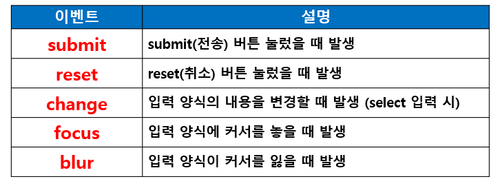
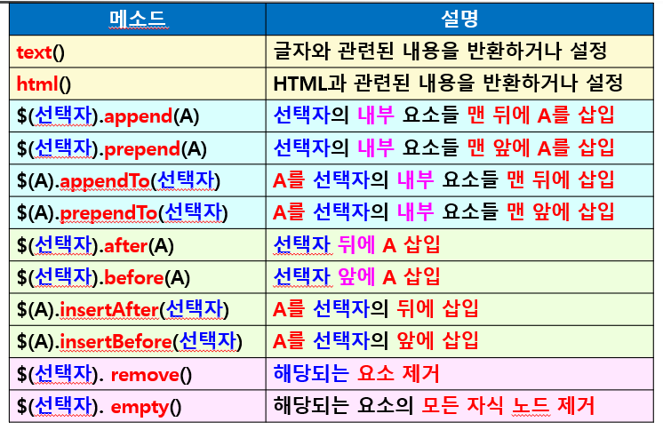

# jQuery

* 2006년 존 레식(John Resig)이 디자인한 자바스크립트 라이브러리
  * 자바스크립트를 이용해 만든 다양한 함수들의 집합
* 무료로 사용 가능한 오픈 소스 라이브러리


#### jQuery 특징

* jQuery 용량은 약 100Kb로 가벼움
* 동적으로 HTML이나 CSS 컨트롤 능력 탁월
* 짧고 간결하게 코딩 가능
* 웹 표준과 타 브라우저 호환성이 뛰어남(크로스-브라우저 지원)
* 편리한 Ajax 호출 방법
* 메소드 체인 방식(여러 메소드를 연겨하여 사용)으로 효율적인 코딩 가능, 간결하고 효과적인 코드 수정 가능
* 다양한 플러그인 제공


#### jQuery 기능

* DOM 처리
* 이벤트 처리
* 시각 효과 구현
* Ajax 기능 구현

##### JavaScript와 jQuery 코드 비교

```javascript
// JavaScript
window.onload = function() {
	var ul = document.getElementById('ul');
	var lis = ul.getElementByTagName('li');

for(var i=0;i<lis.length;i++){
	if(lis[i].className == 'three'){
		var span = lis[i].getElementsbyTagName('span');
		span[0].style.color='red';
	}
  }
}

// jQuery
$(document).ready(function(){
	$('#ul1 > .three > span').css('color','red');
});
```


#### jQuery 개발 환경

1) jQuery 파일 다운로드 방식

   * 웹 애플리케이션 서버에 HTML, CSS, JavaScript 파일들과 같이 jQuery 파일이 있어야 함

   * 이 경우 웹 애플리케이션에 접근한 이용자마다 jQuery 파일을 다운로드 해야 함

   * 트래픽 증가 요인

2) CDN을 이용하는 방식

   * Content Delivery Network
   * 사용자가 요청한 콘텐츠를 '사용자와 가장 가까운 곳에 위치한 캐시 서버에서 전달해 주는 것'
   * jQuery 파일 다운로드 없이 CDN에 있는 파일 링크만 하면 됨
   * 구글이나 마이크로소프트 등과 같은 기업이 jQuery 파일 제공
   * 네트워크 분산으로 병목 현상을 피할 수 있고, jQuery 파일의 다운로드에 따른 부하가 없으므로 트래픽 감소 효과
   * 그러나 라이브러리 제공 서버나 인터넷에 문제가 있을 경우 제공받을 수 없음


______________


## jQuery 기본


#### jQuery 코드 형태

* 객체 구조로 `객체.메소드` 형태
* 객체 선택
  * `$("선택자").메소드`
  * `$("p").메소드` : 모든 <p> 태그 선택
* 사용자가 생성한 객체 사용
  * `객체.메소드`
  * `var obj = $("선택자").메소드;`
  * `obj.메소드;`
* 메소드 체이닝
  * 여러 개의 메소드를 연결해서 사용하는 것
  * `객체.메소드1.메소드2. ...`


#### jQuery 치환

* jQuery의 모든 함수 및 객체는 jQuery에서 제공되는 것이라는 점을 나타내기 위해 코드 앞에 jQuery 키워드 사용

  ```javascript
  jQuery(document).ready(function() {
  ...
  });
  
  // 쉽게 하기 위해 $ 문자로 치환해서 사용
  $(document).ready(function() {
  ...
  });
  ```

  

* `$(document).ready(함수)` 명령어
  * 화면에 페이지가 로딩된 실행
  * HTML 문서가 화면에 보여진 후에 자동으로 포함된 함수를 실행
  * 자바스크립트의 다음 문장과 동일하게 사용
    * `window.onload = function() {...};`
    * `$(document).ready()` 와 `window.onload=function()`의 차이점
      * `$(document).ready()`
        * DOM 요소가 로드되었을 때 이벤트 발생하면서 호출(외부 리소스, 이미지 또는 음악 등이 로드되기 전)  → _순서상 가장 먼저 시행됨_
      * `window.onload = function()`
        * DOm 요소 뿐 아니라 외부 리소스, 이미지 또는 음악 등 모든 콘텐츠의 로드가 끝나는 시점에서 이벤트가 발생하면서 호출

```html
<!DOCTYPE html>
<html>
	<head>
		<meta charset="UTF-8">
		<title>jQuery 시작</title>
		<script src="jquery-3.5.1.min.js"></script> <!-- jQuery 파일을 불러오는 코드 -->
		<script type="text/javascript">
			// 문서(document)가 준비 완료 되면 함수를 실행하라고 명령할 수 있음
			$(document).ready(function() {
				alert("jQuery 시작!!!!");
			});
		</script>
	</head>
	<body>
	
	</body>
</html>
```


___________________


## jQuery 선택자


#### jQuery 선택자 (selector)

* jQuery의 코드는 선택자와 메소드의 조합으로 구성되는 경우가 많음
* HTML 태그를 쉽게 선택하기 위해 선택자 사용


#### 선택자 구조

* `$("선택자").메소드(매개변수, 함수 등)`
* `$("span").hide()`
  * 큰 따옴표/작은 따옴표 모두 사용 가능


#### 선택자 종류

* 직접 선택자

  * 전체, 태그, 아이디, 클래스, 그룹 선택자

  

  ```html
  <!doctype html>
  <html>
      <head>
          <meta charset="utf-8">
          <title>jQuery 직접 선택자</title>
          <script src="jquery-3.5.1.min.js"></script>
  		<script type="text/javascript">
  			$(document).ready(function(){
  				//$("선택자").css(‘속성’, ’값’); / 해당 선택 객체의 css 속성을 변경시켜주는 함수
  				//큰 따옴표, 작은 따옴표 다 사용 가능
  				//1. 전체 선택자 : 문서 전체의 글자색 변경
                  $("*").css("color","red");
  					 
  				//2. 태그 선택자 : h3 태그에 밑줄 그리기
                  $("h3").css("textDecoration","underline")
  					 
  				//3. 태그 선택자 : h3, h4 태그에 배경색 pink 지정하기
                  $("h3,h4").css("backgroundColor","pink")
  				
  				//4. ID 선택자 : id가 idSelector인 태그의 글자 색상을 blue/#0000ff/#00f
  				//id가 jQuery인 태그의 글자 색상을 green으로 설정
                  $("#idSelector").css("color","blue")
                  $("#jQuery").css("color","green")
  
  				//5. 클래스 선택자 : class가 selector인 태그의 글자를 이탤릭체로,
  				//class가 web인 태그의 글자를 굵게
                  $(".selector").css('font-style','italic')
                  $(".web").css('font-weight','bold')
  			});
  		</script>        
  	</head>
  	<body>		
          <h3>jQuery 직접 선택자 (selector)</h3>        
          <div class="selector">
              <ol>
                  <li>전체 선택자</li>
                  <li>태그 선택자</li>
                  <li  id="idSelector">ID 선택자 </li>
                  <li>클래스 선택자</li>
              </ol>
          </div>	        
          
          <h4>웹 프로그래밍</h4>
          <div class="web">
              <ol type="A">
                  <li>JSP</li>
                  <li>Javascript</li>
                  <li  id="jQuery">jQuery</li>
                  <li>Ajax</li>
              </ol>
          </div>	
  	</body>
  </html>
  ```

  

* 인접 관계 선택자

  * 상위 요소 (조상/부모) 선택자
  * 하위 요소 (자식/자손) 선택자
  * 형제 선택자


```html
<!doctype html>
<html>
    <head>
        <meta charset="utf-8">
        <title>자식/자손 선택자</title>
        <script src="jquery-3.5.1.min.js"></script>
		<script type="text/javascript">
			$(function(){ //$(document).ready(함수)의 단축 형태
				//1. <ol> 태그의 모든 자손 <li> 태그 글자색 red
                $("ol li").css('color','red');

				//2. <ol> 태그의 자식(바로 한 단계 밑) <li> 태그 글자색 blue
                $("ol > li").css('color','blue');

				//3. 아이디가 children인 요소의 자식 <li> 태그 밑줄
                $("#children > li").css('text-decoration','underline');
				
				//4. 클래스가 method 요소의 모든 자손 요소의 글자색을 black
				//find() 메소드 사용
                $('.method').find('li').css('color','black');

				//5. 클래스가 method 요소의 자식 요소에 속성 2개 설정
				//children() 메소드 사용
                $('.method').children('li').css({'color':'green','font-style':'italic'})

			});	
		</script>        		
    </head>
    <body>        
        <h3>자식/자손 선택자</h3>
        <ol>
        	<li>자손 요소의 선택 방법</li>
                <ul>
                       <li>&#36;(“선택자 선택자”)</li>
                       <li>$(“ol li”)</li>
                       <li>ol 의 자손인 모든 li 태그 선택 : 글자색(red)</li>
                </ul> 
            <li>자식 요소의 선택 방법</li>
                <ul id="children">
                   <li>$(“선택자>선택자”)</li>
                   <li>$(“ol>li”)</li>
                   <li>ol의 자식인 li 태그 선택 : 글자색(blue)</li>
                   <li>$(“ul>li”)</li>
                   <li>ul의 자식인 li 태그 선택 : 글자(underline)</li>
                </ul>               
             <li>메소드를 사용하는 방법</li>   
                 <ol class="method">
                   <li>자손 요소 선택 : find()</li>
                   	<ul>
                       <li>$(“선택자”).find(“선택자”)</li>
                       <li>$(“.method).find(“li”)</li>
                       <li>클래스 method 모든 자손 li 태그 선택 : 글자색(black)</li>
                    </ul>       
                   <li>자식 요소 선택 : children()</li>
                   	<ul>
                       <li>$(“선택자”).children(“선택자”)</li>
                       <li>$(“.method).children(“li”)</li>
                       <li>클래스 method 자식 선택 : 글자색(green)</li>
                    </ul>
                 </ol>            
        </ol>
    </body>
</html>
```


* 필터 선택자
  * 태그의 상태나 순서 등으로 선택
    * `$("태그명:순서필터")`
      * `$("tr:odd")` : 홀수 행인 경우
    * `$("태그명:상태필터")`
      * `$("input:checked")` : 체크 상태인 경우


```html
<!doctype html>
<html>
    <head>
        <meta charset="utf-8">
        <title>필터 선택자</title>
        <script src="jquery-3.5.1.min.js"></script>
		<script type="text/javascript">
			$(document).ready(function(){  
				//table1에서 찾기 
				//1. 홀수행 (1, 3, 5, ...) (행 인덱스는 0부터 시작)
                $("#table1 tr:odd").css('background-color','grey');
				
				//2. 짝수행 (0, 2, 4, 6, ...)
                $("#table1 tr:even").css('background-color','green');
				
				//3.첫번째 행 (0행) backgroud , fontSize  속성
                $("#table1 tr:first").css({'background-color':'pink','fontSize':'20pt'});
				
				//4. tr의 5행 (0부터 시작하므로 여섯번째 행)의 배경색을 빨강색으로
                $("#table1 tr:eq(5)").css('background-color','red');
				 
				//5. tr의 5행 보다 큰 행 전부 (일곱번째인 6행부터 아래 전부)
                $("#table1 tr:gt(5)").css('color','blue');
				
				//table2에서 찾기		
				//6. tr의 0행 제외 하고 background='gold'
                $("#table2 tr:not(tr:eq(0))").css('background-color','gold');
				
				//nth : 서수 (번째) -> 인덱스와 다름!
				//7. nth-child(숫자n+1) : 3n+1번째 행 : 3의 배수 + 1 = 1, 4, 7, 10 
				//첫번째, 네번째, 일곱번째, 열번째 행	
                $("#table2 tr:nth-child(3n+1)").css('background-color','orange');
				
				//8. nth-child(숫자n) : 2n : 짝수 번째 열
                $("#table2 td:nth-child(2n)").css('background-color','red');
			});        
		</script>        
    </head>
    <body>
        <h1>table1</h1>
        <table id="table1" width="300">
             <tr><th>이름</th><th>나이</th><th>주소</th></tr> 
             <tr><td>박지성</td><td>20</td><td>서울</td></tr>
             <tr><td>이동국</td><td>10</td><td>인천</td></tr>
             <tr><td>이대호</td><td>23</td><td>부산</td></tr>
             <tr><td>추신수</td><td>30</td><td>대구</td></tr>
             <tr><td>기성용</td><td>35</td><td>서울</td></tr>
             <tr><td>김연아</td><td>27</td><td>수원</td> </tr>
             <tr><td>손연재</td><td>20</td><td>원주</td></tr>
             <tr><td>손홍민</td><td>21</td><td>순천</td></tr>
             <tr><td>박인비</td><td>40</td><td>대구</td></tr>
        </table>
        <br><br>
        <h1>table2</h1>
        <table id="table2" width="300">
             <tr><th>이름</th><th>나이</th><th>주소</th></tr> 
             <tr><td>박지성</td><td>20</td><td>서울</td></tr>
             <tr><td>이동국</td><td>10</td><td>인천</td></tr>
             <tr><td>이대호</td><td>23</td><td>부산</td></tr>
             <tr><td>추신수</td><td>30</td><td>대구</td></tr>
             <tr><td>기성용</td><td>35</td><td>서울</td></tr>
             <tr><td>김연아</td><td>27</td><td>수원</td> </tr>
             <tr><td>손연재</td><td>20</td><td>원주</td></tr>
             <tr><td>손홍민</td><td>21</td><td>순천</td></tr>
             <tr><td>박인비</td><td>40</td><td>대구</td></tr>
        </table>
    </body>
</html>
```


* 속성 선택자
  * 문서에 삽입된 HTMlL 태그(요소)의 지정된 속성 값에 따라 선택자로 정의


```html
<!doctype html>
<html>
    <head>
        <meta charset="utf-8">
        <title>속성 선택자</title>   
        <script src="jquery-3.5.1.min.js"></script>
		<script type="text/javascript">    
			$(document).ready(function(){
            // 1. input 태그의 속성인 type을 찾아서 바탕색을 'pink'로 변경
                $("input[type]").css('background-color','pink');

            // 2. 속성 type이 text인 태그를 찾아 글자 색상을 blue, width를 200으로 변경
                // $("input[type=text]").css({'color':'blue','width':'200px'});
                $(":text").css({'color':'blue','width':'200px'}); // :속성명으로 사용 가능

            // 3. 속성 type 중 submit, reset 버튼을 찾아서 배경색을 gold로 변경
                $(":submit,:reset").css('backgroundColor','gold');

            // 4. 속성 type 중 password 찾아서 글자색과 width 변경
                $(":password").css({'color':'red','width':'200px'});

            // 5. 속성 type 중 password 찾아서 글자색, 배경색, width 변경 - 메소드 체인 방식을 사용
                $(":password").css({'color':'red', 'backgroundColor':'green'}).css('width','200px');

            // 6. option 태그의 value 속성의 값이 프로그래머인 요소를 찾아 글자색을 red로 변경
                $("option[value=프로그래머]").css('color','red')

            // 7. option 태그의 value 속성의 값이 웹으로 시작하는 요소를 찾아 글자색을 blue로 변경
                $("option[value^=웹]").css('color','blue')

            // 8. select 태그의 하위 option 태그의 value 속성의 값이 '사'로 끝나는 요소를 찾아 글자색을 green으로 변경
                $("select > option[value$=사]").css('color','green')
	         });
		</script>  
   </head>
    <body>
      <h1>속성 선택자</h1>
      <form id="form1" method="post" action="ok.jsp">
          <table>
            <tr><td>이름</td><td><input type="text" id="name" value="홍길동"></td></tr>
            <tr><td> ID</td><td><input type="text" id="id"></td></tr>
            <tr><td>비밀번호</td><td><input type="password" id="passwd"></td></tr>
            <tr><td>취미 :</td>
                  <td><input type="checkbox"  id="sports" value="운동">운동
                         <input type="checkbox"  id="fishing" value="낚시">낚시
                         <input type="checkbox"  id="swimming" value="수영">수영</td></tr>
            <tr><td>직업</td>
                  <td><select id="job">
                               <option value="학생">학생</option>
                               <option value="프로그래머">프로그래머</option>
                               <option value="웹디자이너">웹디자이너</option>
                               <option value="회계사">회계사</option>
                               <option value="의사">의사</option>	
                          </select></td></tr>
             <tr>
                <td colspan="2" align="center">
                    <input type="submit" value="완료">
                    <input type="reset" value="취소">
                </td>
            </tr>             
        </table>
      </form>	    
    </body>
</html>
```


* 콘텐츠 탐색 선택자
  * `$("선택자:contains("내용")")`
    * "내용"을 포함하는 요소 선택
  * `$("선택자:has("span")")`
    * <span> 태그를 포함하는 요소 선택


* CSS 선택자를 이용해 원하는 노드 찾기
  * 형식
    * `var $변수명 = $('선택자');`
    * 여러 개를 찾은 경우 변수는 배열로 생성됨
      * `var $tds = $('td'); 	// td 태그 모두 선택`
      * 다음의 자바스크립트와 동일함
      * `var tds = document.getElementsByTagName('td');`
    * jQuery 변수명(객체)에는 $ 사용
    * __자바스크립트 변수(객체)로는 jQuery 메소드 사용할 수 없음__

```html
<!DOCTYPE html>
<html>
	<head>
		<meta charset="UTF-8">
		<title>jQuery 변수</title>
		<script src="jquery-3.5.1.min.js"></script>
		<script type="text/javascript">    
			$(document).ready(function() { 	    
				//jQuery 변수 $box1은 object형
	        	var $box1= $('#box1'); //ID 선택자
	        	//jQuery 메소드 사용 가능
	        	$box1.css('color', 'red');
	        	//$box1의 타입 출력 : object(객체)
	        	$box1.text(typeof $box1);
	        	//box1.innerHTML = typeof $box1; //동일	     
	        	
	        	//자바스크립트 사용 아이디로 요소 찾아와서 jQuery 메소드 사용할 경우
				var box2 = document.getElementById('box2');
				// box2는 자바스크립트 변수에 해당함
				// box2.css('color', 'blue'); //jQuery 메소드 css()는 사용할 수 없음
				
	        	//jQuery 변수에 값 저장되는 경우
	        	//변수 $divLen에 <div> 태그 개수 저장
	        	var divLen= $('div').length; //태그 선택자
	        	//box2에 변수 $divLen 타입 출력 : number(숫자)
	        	var $box2= $('#box2'); //ID 선택자
	        	$box2.text(typeof divLen);
	        });
			// jquery 변수에 저장되는 data가 jquery 객체면 $ 기호를 사용
			// jquery 객체의 속성이나 메서드로 반환되는 값(객체가 아닌 일반 값)을 저장할 때는 $ 기호를 사용하지 않음
        </script>    
	</head>
	
	<body>
		<div id="box1">box1</div>
		<div id="box2">box2</div>
		<div id="box3">box3</div>
	</body>
</html>
```


#### jQuery 변수

* 변수명 앞에 $ 붙임 (생략해도 오류 없음)
  * `var $box1 = $('#box1');	// ID 선택자`
  * $box1의 타입은 object로, jQuery 함수 사용 가능
  * `$box1.css('color', 'red');`
  * `var $divLen = $('div').length;	// 태그 선택자`
    * `<div>` 태그 개수 저장
    * `$divLen`의 타입은 number
      * 이 경우 일반적으로 $ 붙이지 않음
    * `var divLen = $('div').length;`


____


## jQuery 이벤트


#### jQuery 이벤트

* 기존의 자바스크립트에서 사용했던 이벤트를 대부분 사용
* jQuery를 이용하여 이벤트를 처리하면 훨씬 간단하게 처리 가능함


##### 이벤트 사용 기본 구조

* 이벤트 대상 : `$('#btn')`

* 이벤트 등록 메소드(이벤트 유형) : `click()`

* 이벤트 핸들러 (이벤트 처리 함수) : `function() { ... }`

  ```html
  <!DOCTYPE html>
  <html lang="en">
  <head>
      <meta charset="UTF-8">
      <title>연습문제2</title>
      <script src="jquery-3.5.1.min.js"></script>
      <script>
        $(document).ready(function() {
          var colors=['red','green','blue'] // 클릭 시 반복돼야 하는 색상
          var currentColor=0; // 현재 표시되고 있는 색상을 의미하는 변수
          $('div').css('backgroundColor',colors[currentColor]
                      ).click(function() { // 클릭 이벤트 함수이기 때문에 클릭할 때마다 실행되는 함수
                            currentColor = (currentColor+1) % 3;
                            $(this).css({'backgroundColor':colors[currentColor]}); // css 함수의 종료
          }); // click 이벤트 함수의 종료
  
        }); // ready 함수 종료
      </script>
  
    <style>
        div {
          width:100px;
          height:50px;
          line-height:50px; /* 글자를 수직 중앙 정렬 */
          text-align: center;
          color:white;
          border:none;
          border-radius:10px;
        }
      </style>
  
  </head>
  <body>
    <div>클릭</div>
  </body>
  </html>
  ```

  


##### 이벤트 등록 메소드 유형 (이벤트 적용 방법)

* 단독 이벤트 등록 메소드

  * 한 동작에 대한 이벤트를 등록할 때 사용하는 메소드
  * 선택자에 직접 이벤트 메소드를 적용하는 방법
  * `$('선택자').이벤트유형(실행함수)`
  * _주의_  :  __동적 연결 지원 안 됨__

  ```html
  <!doctype html>
  <html>
      <head>
          <meta charset="UTF-8">
          <title>append()/prepend()/after()/before()</title>
          <style type="text/css">		 	
  			#box { width:500px; height: 200px; line-height:200px; 
  			                  border:1px solid #000; }
  			img {vertical-align:middle;}					
  		</style>	
  		<script src="jquery-3.5.1.min.js"></script>
  		<script type="text/javascript">
  			$(document).ready(function() {		  
  			   //태그 내용을 img 변수에 저장
  			   var img = "";
  			   
  			   //[prepend] 버튼 클릭했을 때 
  			   $('#prepend').on('click', function(){				   
  			   	  //ID 선택자 box의 내부 요소들 맨 앞에 img 삽입
                      $('#box').prepend(img); // img는 변수명
  			   });
  			   
  			   //[append] 버튼 클릭했을 때 			   
  			   $('#append').on('click', function(){
  				   //ID 선택자 box의 내부 요소들 맨 뒤에 img 삽입
                      $('#box').append(img); // img는 변수명
  			   });	
  			   
  			  //[before] 버튼 클릭했을 때
  			  $('#before').on('click', function(){	
  				   //ID 선택자 box 앞에 img 추가 (div 영역 외부에 추가)
                      $('#box').before(img); // img는 변수명
  			   });			   
  			   
  			   //[after] 버튼 클릭했을 때
  			   $('#after').on('click', function(){	
  				  //ID 선택자 box 뒤에 img 추가 (div 영역 외부에 추가)							
                      $('#box').after(img); //
  			   });		
  			   
  			  //[empty] 버튼 클릭했을 때
  			   $('#empty').on('click', function(){	
  				  //ID 선택자 box 안의 요소들	제거				
                      $('#box').empty();
  			   });	
  			 
  			  //[remove] 버튼 클릭했을 때
  			   $('#remove').on('click', function(){	
  				  // 태그 제거					
                      $('img').remove()
  			   });	
  			 
  			  //[초기화] 버튼 클릭했을 때
  			   $('#initiate').on('click', function(){	
  				   //<div> 내부 요소 비우고 추가
                      $('div').empty().append("div 내부 ");
  			   });
  			});
  		</script>
  	</head>
  
      <body>
          <button id="prepend" >prepend</button> 
          <button id="append" >append</button> 
          <button id="before" >before</button> 
          <button id="after" >after</button> 
          <button id="empty" >empty</button> 
          <button id="remove" >remove</button> 
          <button id=initiate >초기화</button>
          <p>
          <div id="box">
          	div 내부 
          </div>    
      </body>
  </html>
  ```


* 그룹 이벤트 등록 메소드 (여러 이벤트 적용)

  * 한 번에 여러 개의 이벤트 등록 가능
  * 선택자에 __on()__ 메소드를 이용하여 이벤트 종류를 바인딩 시키는 방법 (jQuery 1.7 ver 이상부터 지원)
  * _동적으로 생성된 요소에 적용 가능_
  * `$('선택자').on('이벤트유형1 2 3 ...', 실행함수)`

  ```html
  <!doctype html>
  <html>
      <head>
          <meta charset="UTF-8">
          <title>클래스 속성 추가/해제</title>
          <style type="text/css">        	
  			* { text-align:center; }
  			.h1Css {
  				background-color:gold;
  				color:blue;
  			}
  			.imgCss { 
  				opacity:0.5; 
  				box-shadow: 5px 5px 10px 1px #777777;
  				/* x-position y-position blur color */
  			}
  			.hidden{ visibility:hidden; }
  		</style>
  		<script src="jquery-3.5.1.min.js"></script>
  		<script type="text/javascript">
  			$(document).ready(function() {			
  				$('img')			 
  					.on('mouseover', function(){		//마우스 올렸을 때
  							//imgCss 클래스 효과 적용
  
  							//h1Css 클래스 효과 적용
  					 })					
  					.on('mouseout', function(){				//마우스 뗐을 때	
  							//imgCss 클래스 효과 제거
  
  							//h1Css 클래스 효과 제거
  				});
  				
  				//<button> 클릭 시
  				//addClass()와 removeClass()를 번갈아 가면서 실행
  				$('button').on('click', function(){	
  					 //hidden 클래스 효과
  				});				
  	 	   });
  		</script>
  	</head>
  	<body>
  		<div id="wrap">
  	        <h1>이미지에 마우스를 올려보세요.</h1>          
  	        <br><br>
  	        <button id="toggle">toggleClass</button>
          </div>
  	</body>
  </html>
  ```

  

* 그룹 이벤트 등록 메소드 종류


* 이벤트 제거 메소드


##### 이벤트 연결 방식

* 정적 연결

  * 현재 HTML 화면에 있는 태그에만 이벤트 연결
  * jQuery를 통해 새로 삽입되는 태그에는 이벤트 연결 안 됨

* 동적 연결

  * 현재 HTML 화면에 표시된 요소와 앞으로 생성될 요소에 전부 이벤트 연결

  * 동적 연결 이벤트 적용 방법

    * `$(document).on("이벤트", "이벤트 발생 객체(새 객체)", 실행함수);`

    ```html
    <!doctype html>
    <html>
        <head>
            <meta charset="UTF-8">
            <title>append()/prepend()/after()/before()</title>
            <style type="text/css">		 	
    			#box { width:500px; height: 200px; line-height:200px; 
    			                  border:1px solid #000; }
    			img {vertical-align:middle;}					
    		</style>	
    		<script src="jquery-3.5.1.min.js"></script>
    		<script type="text/javascript">
    			$(document).ready(function() {		  
    			   //태그 내용을 img 변수에 저장
    			   var img = "";
    			   
    			   //[prepend] 버튼 클릭했을 때 
    			   $('#prepend').on('click', function(){				   
    			   	  //ID 선택자 box의 내부 요소들 맨 앞에 img 삽입
                        $('#box').prepend(img); // img는 변수명
    			   });
    			   
    			   //[append] 버튼 클릭했을 때 			   
    			   $('#append').on('click', function(){
    				   //ID 선택자 box의 내부 요소들 맨 뒤에 img 삽입
                        $('#box').append(img); // img는 변수명
    			   });	
    			   
    			  //[before] 버튼 클릭했을 때
    			  $('#before').on('click', function(){	
    				   //ID 선택자 box 앞에 img 추가 (div 영역 외부에 추가)
                        $('#box').before(img); // img는 변수명
    			   });			   
    			   
    			   //[after] 버튼 클릭했을 때
    			   $('#after').on('click', function(){	
    				  //ID 선택자 box 뒤에 img 추가 (div 영역 외부에 추가)							
                        $('#box').after(img); //
    			   });		
    			   
    			  //[empty] 버튼 클릭했을 때
    			   $('#empty').on('click', function(){	
    				  //ID 선택자 box 안의 요소들	제거				
                        $('#box').empty();
    			   });	
    			 
    			  //[remove] 버튼 클릭했을 때
    			   $('#remove').on('click', function(){	
    				  // 태그 제거					
                        $('img').remove()
    			   });	
    			 
    			  //[초기화] 버튼 클릭했을 때
    			   $('#initiate').on('click', function(){	
    				   //<div> 내부 요소 비우고 추가
                        $('div').empty().append("div 내부 ");
    			   });
    			});
    		</script>
    	</head>
    
        <body>
            <button id="prepend" >prepend</button> 
            <button id="append" >append</button> 
            <button id="before" >before</button> 
            <button id="after" >after</button> 
            <button id="empty" >empty</button> 
            <button id="remove" >remove</button> 
            <button id=initiate >초기화</button>
            <p>
            <div id="box">
            	div 내부 
            </div>    
        </body>
    </html>
    ```

    


##### 이벤트 종류

* 윈도우 이벤트 종류


```html
<!DOCTYPE html>
<html lang="en">
<head>
    <meta charset="UTF-8">
    <title>윈도우 이벤트</title>
    <script src="jquery-3.5.1.min.js"></script>
    <script type="text/javascript">
      $(document).ready(function() {
        // 윈도우 크기가 변경될 때(=resize 이벤트가 발생했을 시)배경색을 다르게 변경
        $(window).resize(function() {
          // 윈도우 크기에 따라 배경색을 다르게 설정
          // width >= 900 이면 'green', >= 800 이면 'yellow', 그 외는 'red'

          // 1. 윈도우 크기를 알아와서
          var winWidth = $(window).width(); // 윈도우 크기를 반환하는 코드
          var winHeight = $(window).height(); // 윈도우의 높이를 반환하는 코드

          // 2. <h3> 태그에 윈도우 크기를 출력
          $('h3').text('윈도우크기: ' + winWidth + 'x' + winHeight);

          // 3. 크기에 따라 변경할 색상값을 변수에 저장
          if(winWidth >= 900)
            bgColor = "green";
          else if(winWidth >= 800)
            bgColor = "yellow";
          else
            bgColor = "red";

          // 4. bgColor 변수에 저장된 색상값을 body 태그의 배경색으로 설정
          $('body').css('background-color',bgColor);

        });
      });
    </script>
</head>
<body>
  <h3>윈도우 크기 : 윈도우 크기를 변경해보세요.</h3>
</body>
</html>
```


* `$(document).ready()` 와 `$(window).load()` 의 차이
  * `$(document).ready()`
    * document의 DOM 객체가 로드되고, 브라우저가 DOM 트리를 생성한 직후에 실행됨
    * 외부 리소스, 이미지 등의 로드 여부와 상관 없이 실행
  * `$(window).load()`
    * HTML 문서뿐 아니라 모든 외부 리소스(ex) css, js, 이미지)가 웹 브라우저 메모리에 모두 올려지면 실행
  * 이벤트 발생 순서
    * `$(document).ready()`가 먼저, `$(window).load()`가 뒤에 발생
    * 이벤트 시점에 따라 오작동이 발생할 가능성이 있기 때문에 같이 사용하지 않고 분리해서 작성함


* 마우스 이벤트 종류


* 키보드 이벤트 종류


```js
/*
* 회원가입 폼 입력 확인
 */

/*
ID 입력란에 포커스 주고
완료 버튼 눌렀을 때 입력 유무 확인한 뒤 알림창 출력
 */

$(document).ready(function() {
    $('#id').focus(); // 시작 시 id에 포커스

    // input 태그의 텍스트 입력란과 비밀번호 입력란에 포커스가 있을 때 배경색 변경
    $('input[type="text"], input[type="password"]').on('focus', function() {
        $(this).css('backgroundColor','rgb(232,232,232)');
    });

    // input 태그의 텍스트 입력란과 비밀번호 입력란에 포커스를 잃으면 배경색은 흰색
    $('input[type="text"], input[type="password"]').on('blur', function() {
        $(this).css('backgroundColor','white');
    });

    // 키보드 이벤트
    // 전화번호 입력란에 첫 번째 입력 칸 - 입력 글자수가 3이면 다음 입력칸으로 이동 (focus)
    $('#hp1').on('keyup',function() {
        if($(this).val().length==3)
            $('#hp2').focus();
    });

    // 두 번째 입력칸 입력 글자수가 4개면 마지막 입력칸으로 이동 (focus)
    $('#hp2').on('keyup',function() {
        if($(this).val().length==4)
            $('#hp3').focus();
    });


    // 엔터키를 눌렀을 때 무조건 submit이 되지 않도록 문서 전체에 이벤트 처리
    // [ENTER]키의 아스키 코드값 = 13
    $(document).on('keydown',function(e) {
       if(e.keyCode == 13){
           return false;
       }
    });


    $('#newMemberForm').on('submit',function(){
    // id 입력 유효성 검사
        if($('#id').val()=="") { // 입력하지 않은 경우
            alert("아이디를 입력하세요.");
            $('#id').focus();
            return false; // 서버로 전송되지 않도록 전송 기능 막음
        }
    // 비밀번호 입력 유효성 검사
        if($('#pwd').val()=="") { // 입력하지 않은 경우
            alert("비밀번호를 입력하세요.");
            $('#pwd').focus();
            return false; // 서버로 전송되지 않도록 전송 기능 막음
        }

    // 학년에 해당하는 라디오 버튼을 선택하지 않은 경우
        if(!$('input[type="radio"]').is(':checked')) {
            alert("학년을 선택하세요.");
            return false;
        }

    // 체크박스를 선택하지 않은 경우
        if(!$('input[type="checkbox"]').is(':checked')) {
            alert("관심분야는 1개 이상 선택하세요.");
            return false;
        }

    // 학과(select 태그)를 선택하지 않은 경우
        if($('select').val()=="") { // 입력하지 않은 경우
            alert("학과를 선택하세요");
            $('select').focus();
            return false; // 서버로 전송되지 않도록 전송 기능 막음
       }


    }); // 폼 submit 종료
}) // ready 함수 끝
```


* 입력 양식 이벤트 종류



```js
/*
* 회원가입 폼 입력 확인
 */

/*
ID 입력란에 포커스 주고
완료 버튼 눌렀을 때 입력 유무 확인한 뒤 알림창 출력
 */

$(document).ready(function() {
    $('#id').focus(); // 시작 시 id에 포커스

    // input 태그의 텍스트 입력란과 비밀번호 입력란에 포커스가 있을 때 배경색 변경
    $('input[type="text"], input[type="password"]').on('focus', function() {
        $(this).css('backgroundColor','rgb(232,232,232)');
    });

    // input 태그의 텍스트 입력란과 비밀번호 입력란에 포커스를 잃으면 배경색은 흰색
    $('input[type="text"], input[type="password"]').on('blur', function() {
        $(this).css('backgroundColor','white');
    });

    // 키보드 이벤트
    // 전화번호 입력란에 첫 번째 입력 칸 - 입력 글자수가 3이면 다음 입력칸으로 이동 (focus)
    $('#hp1').on('keyup',function() {
        if($(this).val().length==3)
            $('#hp2').focus();
    });

    // 두 번째 입력칸 입력 글자수가 4개면 마지막 입력칸으로 이동 (focus)
    $('#hp2').on('keyup',function() {
        if($(this).val().length==4)
            $('#hp3').focus();
    });


    // 엔터키를 눌렀을 때 무조건 submit이 되지 않도록 문서 전체에 이벤트 처리
    // [ENTER]키의 아스키 코드값 = 13
    $(document).on('keydown',function(e) {
       if(e.keyCode == 13){
           return false;
       }
    });


    $('#newMemberForm').on('submit',function(){
    // id 입력 유효성 검사
        if($('#id').val()=="") { // 입력하지 않은 경우
            alert("아이디를 입력하세요.");
            $('#id').focus();
            return false; // 서버로 전송되지 않도록 전송 기능 막음
        }
    // 비밀번호 입력 유효성 검사
        if($('#pwd').val()=="") { // 입력하지 않은 경우
            alert("비밀번호를 입력하세요.");
            $('#pwd').focus();
            return false; // 서버로 전송되지 않도록 전송 기능 막음
        }

    // 학년에 해당하는 라디오 버튼을 선택하지 않은 경우
        if(!$('input[type="radio"]').is(':checked')) {
            alert("학년을 선택하세요.");
            return false;
        }

    // 체크박스를 선택하지 않은 경우
        if(!$('input[type="checkbox"]').is(':checked')) {
            alert("관심분야는 1개 이상 선택하세요.");
            return false;
        }

    // 학과(select 태그)를 선택하지 않은 경우
        if($('select').val()=="") { // 입력하지 않은 경우
            alert("학과를 선택하세요");
            $('select').focus();
            return false; // 서버로 전송되지 않도록 전송 기능 막음
       }


    }); // 폼 submit 종료
}) // ready 함수 끝
```


____


## jQuery DOM 요소 조작

* 동적으로 DOM 요소 조작
* jQuery를 이용하면 쉽고 간단하게 조작 가능


#### DOM 요소 삽입/삭제 관련 메소드




```html
<!doctype html>
<html>
    <head>
        <meta charset="UTF-8">
        <title>append()/prepend()/after()/before()</title>
        <style type="text/css">		 	
			#box { width:500px; height: 200px; line-height:200px; 
			                  border:1px solid #000; }
			img {vertical-align:middle;}					
		</style>	
		<script src="jquery-3.5.1.min.js"></script>
		<script type="text/javascript">
			$(document).ready(function() {		  
			   //태그 내용을 img 변수에 저장
			   var img = "";
			   
			   //[prepend] 버튼 클릭했을 때 
			   $('#prepend').on('click', function(){				   
			   	  //ID 선택자 box의 내부 요소들 맨 앞에 img 삽입
                    $('#box').prepend(img); // img는 변수명
			   });
			   
			   //[append] 버튼 클릭했을 때 			   
			   $('#append').on('click', function(){
				   //ID 선택자 box의 내부 요소들 맨 뒤에 img 삽입
                    $('#box').append(img); // img는 변수명
			   });	
			   
			  //[before] 버튼 클릭했을 때
			  $('#before').on('click', function(){	
				   //ID 선택자 box 앞에 img 추가 (div 영역 외부에 추가)
                    $('#box').before(img); // img는 변수명
			   });			   
			   
			   //[after] 버튼 클릭했을 때
			   $('#after').on('click', function(){	
				  //ID 선택자 box 뒤에 img 추가 (div 영역 외부에 추가)							
                    $('#box').after(img); //
			   });		
			   
			  //[empty] 버튼 클릭했을 때
			   $('#empty').on('click', function(){	
				  //ID 선택자 box 안의 요소들	제거				
                    $('#box').empty();
			   });	
			 
			  //[remove] 버튼 클릭했을 때
			   $('#remove').on('click', function(){	
				  // 태그 제거					
                    $('img').remove()
			   });	
			 
			  //[초기화] 버튼 클릭했을 때
			   $('#initiate').on('click', function(){	
				   //<div> 내부 요소 비우고 추가
                    $('div').empty().append("div 내부 ");
			   });
			});
		</script>
	</head>

    <body>
        <button id="prepend" >prepend</button> 
        <button id="append" >append</button> 
        <button id="before" >before</button> 
        <button id="after" >after</button> 
        <button id="empty" >empty</button> 
        <button id="remove" >remove</button> 
        <button id=initiate >초기화</button>
        <p>
        <div id="box">
        	div 내부 
        </div>    
    </body>
</html>

```


* `text()`와 `html()` 메소드
  * 자바스크립트의 `innerHTML` 속성과 유사함
  * 찾은 DOM 요소에 글자(텍스트)를 설정하거나 반환
    * `html()`
      * HTML 태그 인식 (태그 효과 적용)
    * `text()`
      * HTML 태그 인식하지 못하고 글자로 인식

```html
<!DOCTYPE html>
<html>
	<head>
		<meta charset="UTF-8">
		<title>text()/html()</title>
		<script src="jquery-3.5.1.min.js"></script>
		<script type="text/javascript">
			$(document).ready(function(){
				// 1. text() : <div> 태그의 문자열 반환(태그 제외 문자만 반환)
				var aText = $('#a').text();
				alert("text : "+aText);

				// 2. html() : <div> 태그의 문자열 반환(태그 포함)
				var aHtml = $('#a').html();
				alert("html : " + aHtml);

				// 3. html()과 text() 함수를 이용하여 내부 요소 설정
				// $('#b').text("<h1>jQuery</h1>"); // h1 태그가 해석이 안 되면서 글자 그대로 출력
				$('#b').html("<h1>jQuery</h1>"); // h1 태그를 해석하면서 태그 효과가 반영


			})
		</script>
	</head>
	<body>
		<div id="a"><h3>A</h3></div>
        <div id="b"><h3>B</h3></div>
	</body>
</html>
```


_______


## jQuery 효과


#### jQuery로 가능한 시각적 효과

* Basic 효과

  * `hide() // show() // toggle()`

    * `hide()` : 요소 숨기기
    * `show()` : 요소 표시
    * `toggle()` : 요소를 숨기거나 표시
      * `hide() / show()` 교대로 실행

    ```html
    <!doctype html>
    <html>
        <head>
            <meta charset="UTF-8">
            <title>Basic 효과</title>   
             <style type="text/css">
    			#wrap { margin:0 auto;  width:800px; text-align:center; }
    			.menuItem { display:inline-block; margin:20px; }		
    			hr { margin-bottom:20px; }		
    		</style>
    		<script src="jquery-3.5.1.min.js"></script>
    		<script type="text/javascript">
    			$(document).ready(function() {
                // [show]버튼 - 속도 slow (slow/normal/fast 모두 쓸 수 있음)
                    $('#show').on('click', function() {
                       $('img').show('slow');
                    });
                // [hide]버튼
                    $('#hide').on('click', function() {
                       $('img').hide('fast');
                    });
                // [toggle1 0.5초]
                    $('#toggle1').on('click', function() {
                       $('img').toggle(500);
                    });
    
                // [toggle2 3초, swing] - 느리게 시작하고 빠르게 진행, 다시 느리게 완료
                    $('#toggle2').on('click', function() {
                       $('img').toggle(3000,'swing');
                    });
    
                // [toggle3 3초, linear] - 일정한 속도로 진행
                    $('#toggle3').on('click', function() {
                       $('img').toggle(3000,'linear');
                    });
    
    		 	});
    		</script>
    	</head>
    	<body>
    		<div id="wrap">
                 <h1>Basic 효과 </h1>
                 <div id="menu">
                     <div class="menuItem"><a href="#" id="show">show</a></div>
                     <div class="menuItem"><a href="#" id="hide">hide</a></div>
                     <div class="menuItem"><a href="#" id="toggle1">toggle1 0.5초</a></div>
                     <div class="menuItem"><a href="#" id="toggle2">toggle2 3초 'swing'</a></div>
                     <div class="menuItem"><a href="#" id="toggle3">toggle3 3초 'linear'</a></div>	
                 </div>
                 <hr>
                          
    		</div>
    	</body>
    </html>
    ```

  * 공통 인수

    * `duration` : 효과 진행 속도 (slow / normal / fast)
    * `callback` : 효과 완료 후 수행할 함수
    * `easing`
      * 전체 애니메이션의 적용시간 비율을 원하는 진행 비율로 매핑
      * `swing` : 사인곡선 (느리게 시작해서 빠르게 진행되다가, 나중에 다시 느려지는 효과)
      * `linear` : 선형

    ```html
    <!doctype html>
    <html>
        <head>
            <meta charset="UTF-8">
            <title>Fading 효과</title>   
            <style type="text/css">
    			h2{
    				width:300px; 
    				height:40px;
    				padding:10px;
    				background-color:red;
    				color:yellow;
    				display:none;
    				}
    			ul { list-style:none; }	  /* type 없음 */	
    			li { display:inline-block; margin-right:30px; }				
    		</style>	
    		<script src="jquery-3.5.1.min.js"></script>
    		<script type="text/javascript">
    			$(document).ready(function() {
    				//속도 : 'slow' 'normal' 'fast'	   
    				$('#fadeIn').on('click', function(){	
    	                $('h2').fadeIn('slow');
    	            });
    				
    				$('#fadeOut').on('click', function(){	
    	                $('h2').fadeOut(2000);	//2초
    	            }); // 영역을 차지하지 않는다
    				
    				$('#fadeToggle').on('click', function(){	 
    	                $('h2').fadeToggle(3000, 'linear');
    	             });
    	        });
    		</script>
         </head>          
        <body>
            <center>
                <h1>Fading 효과 </h1>
                <ul>
                    <li><a href="#" id="fadeIn">fadeIn</a></li>
                    <li><a href="#" id="fadeOut">fadeOut</a></li>
                    <li><a href="#" id="fadeToggle">fadeToggle</a></li>
                </ul>
                <hr>
                <h2>Have a Nice Day!</h2>
                <h3>난 어디에 놓일까?</h3>
            </center>
    	</body>
    </html>
    ```

    

* Sliding 효과

  * `slideDown() // slideUp() // slideToggle()`

    * `slideDown()` : 요소를 슬라이딩 효과로 나타나게 함
    * `slideUp()` : 요소를 슬라이딩 효과로 숨김
    * `slideToggle()` :  숨겼다 보였다 교대로 실행
      * `slideDown() / slideUp()` 교대로 실행

    ```html
    <!doctype html>
    <html>
        <head>
            <meta charset="UTF-8">
            <title>Sliding 효과</title>   
    		<style type="text/css">	
    			*{ text-align:center;}		
    			#menuBox {width:100px; margin:0 auto; margin-bottom:30px;}	
    			#menuBox:hover { 
    					background-color:orange;
    					color:blue;
    					font-weight:bold;
    				}				
    			#subMenuBox {display:none;} /* 차지하고 있는 영역이 없음 */
    		</style>
    		<script src="jquery-3.5.1.min.js"></script>
    		<script type="text/javascript">
    			$(document).ready(function() {
                    $('#menuBox').hover(function() { /* 마우스를 메뉴에 올렸을 때 이미지 슬라이드 다운 */
                        $('#subMenuBox').slideDown(1000);
                    },
                    function(){
                        $('#subMenuBox').slideUp(1000);
                    });
                    // 이미지에 슬라이딩 효과를 주면 전체적으로 축소/확대 효과 나타남 -> 이상한 효과(오류)
                    });
    
    		</script>
    	</head>
    	<body>
        	<div>
                <div><h3>Sliding 효과</h3></div>
                <div id="menuBox">메뉴</div>         
                <div id="subMenuBox">
                    
                </div> 
                <button>버튼의 위치는?</button>             
            </div>
    	</body>
    </html>
    ```

    

* Fading 효과

  * `fadeIn() // fadeOut() // fadeToggle() // fadeTo()`

    * `fadeIn()` : 요소를 선명하게 만들면서 나타남
    * `fadeOut()` : 요소를 흐리게 하면서 숨김 (영역도 사라짐)
    * `fadeToggle()` : `fadeIn()`과 `fadeOut()` 효과를 교대로 실행
    * `fadeTo()` : 요소의 불투명도 조정
      * 투명도 0으로 안 보이지만 영역은 그대로 남아있음

     ```html
     <!doctype html>
     <html>
         <head>
             <meta charset="UTF-8">
             <title>Fading 효과</title>   
             <style type="text/css">
     			h2{
     				width:300px; 
     				height:40px;
     				padding:10px;
     				background-color:red;
     				color:yellow;
     				display:none;
     				}
     			ul { list-style:none; }	  /* type 없음 */	
     			li { display:inline-block; margin-right:30px; }				
     		</style>	
     		<script src="jquery-3.5.1.min.js"></script>
     		<script type="text/javascript">
     			$(document).ready(function() {
     				//속도 : 'slow' 'normal' 'fast'	   
     				$('#fadeIn').on('click', function(){	
     	                $('h2').fadeIn('slow');
     	            });
     				
     				$('#fadeOut').on('click', function(){	
     	                $('h2').fadeOut(2000);	//2초
     	            }); // 영역을 차지하지 않는다
     				
     				$('#fadeToggle').on('click', function(){	 
     	                $('h2').fadeToggle(3000, 'linear');
     	             });
     	        });
     		</script>
          </head>          
         <body>
             <center>
                 <h1>Fading 효과 </h1>
                 <ul>
                     <li><a href="#" id="fadeIn">fadeIn</a></li>
                     <li><a href="#" id="fadeOut">fadeOut</a></li>
                     <li><a href="#" id="fadeToggle">fadeToggle</a></li>
                 </ul>
                 <hr>
                 <h2>Have a Nice Day!</h2>
                 <h3>난 어디에 놓일까?</h3>
             </center>
     	</body>
     </html>
     ```

    

* Animate 효과

  * `animate(속성)`
  * 사용자 CSS 효과를 지정하여 애니메이션 수행
    * `duration` : 효과 진행 속도 (slow / normal / fast)
    * `callback` : 효과 완료 후 수행할 함수
    * `easing`
      * 전체 애니메이션의 적용시간 비율을 원하는 진행 비율로 매핑
      * `swing` : 사인곡선 ( 느리게 시작해서 빠르게 진행되다가 나중에 다시 느려지는 효과)
      * `linear` : 선형
  * 애니메이션 정지
    * `$(선택자).stop(); // false 입력한 것으로 간주`
    * `$(선택자).stop(true);  // clearQueue`
      * 대기열에 있는 함수 모두 제거, 예약된 애니메이션 초기화 (clearQueue() 메소드 실행 효과)
    * `$('선택자').stop(true, true);  // claerQueue, goToEnd`
      * 제자리에서 멈추는 것이 아니라 저장한 최종 형태에서 멈춤

```html
<!doctype html>
<html>
    <head>
        <meta charset="UTF-8">
        <title>animate() 효과</title>
        <style type="text/css">			
			div {
				width: 50px; 
				height: 50px;
				line-height:50px;
				text-align:center;
				background-color: rgb(0, 176, 240);
				position: relative;
        	   }		
		</style>
		<script src="jquery-3.5.1.min.js"></script>
		<script type="text/javascript">
        $(document).ready(function() {
            $('div').hover(
                function(){
                    $(this).animate({left:500},1000);
                }, function(){
                    $(this).animate({left:0},4000);
                }
            );
            });
		</script>
    </head>        
     <body>    
        <div>1</div><div>2</div>
        <div>3</div><div>4</div>
        <div>5</div><div>6</div> 
    </body>
</html>

```

